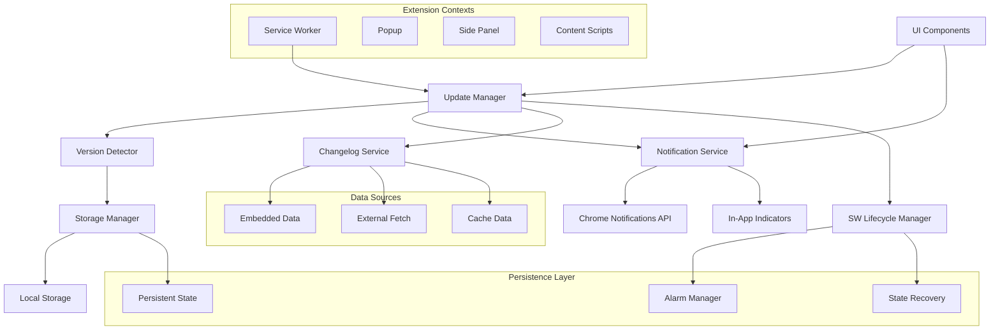
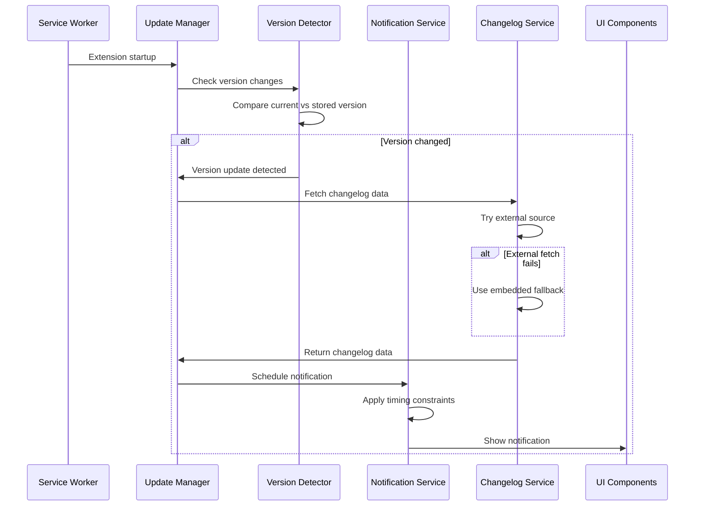
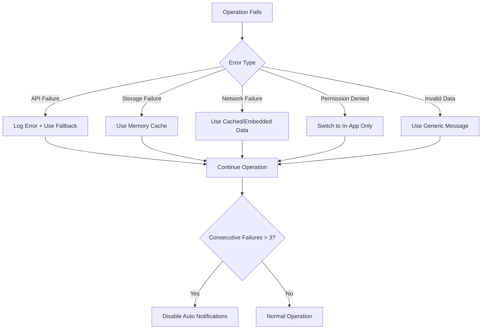

# Design Document

## Overview

The Extension Update Notification System provides a comprehensive, multi-touchpoint approach to informing users about Chrome extension updates. The system leverages Chrome's native notification APIs while providing graceful fallbacks and respecting user preferences. It operates across multiple extension contexts (service worker, popup, side panel) and integrates seamlessly with the existing extension architecture.

The design prioritizes security, performance, accessibility, and user experience while maintaining compatibility with Chrome's Manifest V3 requirements and the extension's existing technology stack.

## Architecture

### High-Level Architecture



### Component Interaction Flow



## Components and Interfaces

### 1. Update Manager (Core Orchestrator)

**Location**: `src/services/updateManager.ts`

**Responsibilities**:
- Orchestrates the entire update notification workflow
- Manages timing constraints and user preferences
- Coordinates between version detection, changelog fetching, and notifications

**Interface**:
```typescript
interface UpdateManager {
  checkForUpdates(): Promise<void>;
  scheduleNotification(updateInfo: UpdateInfo): Promise<void>;
  handleUserInteraction(action: NotificationAction): Promise<void>;
  getUpdateHistory(): Promise<UpdateHistoryEntry[]>;
  setNotificationPreferences(prefs: NotificationPreferences): Promise<void>;
}

// Branded types for type safety
type Version = string & { readonly __brand: 'Version' };
type Timestamp = number & { readonly __brand: 'Timestamp' };
type NotificationId = string & { readonly __brand: 'NotificationId' };
type OperationId = string & { readonly __brand: 'OperationId' };

// Strict enum types
type NotificationFrequency = 'all' | 'major' | 'critical';
type ChangeType = 'upgrade' | 'downgrade' | 'reinstall' | 'invalid';
type OperationType = 'version_check' | 'changelog_fetch' | 'notification_display';
type NotificationRole = 'alert' | 'status' | 'dialog';
type AriaLive = 'polite' | 'assertive' | 'off';

// Strict notification preferences
interface NotificationPreferences {
  readonly enableNativeNotifications: boolean;
  readonly enableInAppIndicators: boolean;
  readonly notificationFrequency: NotificationFrequency;
  readonly dismissalCount: number;
}

interface UpdateInfo {
  readonly fromVersion: Version | null;
  readonly toVersion: Version;
  readonly changelog: ChangelogData;
  readonly updateTimestamp: Timestamp;
  readonly isConsolidated: boolean;
}
```

### 2. Version Detector

**Location**: `src/services/versionDetector.ts`

**Responsibilities**:
- Detects version changes using semantic version comparison
- Handles edge cases (downgrades, reinstalls, invalid versions)
- Manages version history and acknowledgment tracking

**Interface**:
```typescript
interface VersionDetector {
  getCurrentVersion(): string;
  getStoredVersion(): Promise<string | null>;
  detectVersionChange(): Promise<VersionChangeResult>;
  markVersionAcknowledged(version: string): Promise<void>;
  isVersionAcknowledged(version: string): Promise<boolean>;
}

interface VersionChangeResult {
  readonly hasChanged: boolean;
  readonly changeType: ChangeType;
  readonly fromVersion: Version | null;
  readonly toVersion: Version;
  readonly unacknowledgedVersions: readonly Version[];
}
```

### 3. Notification Service

**Location**: `src/services/notificationService.ts`

**Responsibilities**:
- Manages Chrome native notifications and in-app indicators
- Handles permission checks and graceful degradation
- Implements timing constraints and user interaction tracking

**Interface**:
```typescript
interface NotificationService {
  showUpdateNotification(updateInfo: UpdateInfo): Promise<NotificationResult>;
  checkPermissions(): Promise<PermissionLevel>;
  scheduleDelayedNotification(updateInfo: UpdateInfo, delay: number): Promise<void>;
  clearNotification(notificationId: string): Promise<void>;
  showInAppIndicator(updateInfo: UpdateInfo): void;
  hideInAppIndicator(): void;
  batchNotifications(notifications: UpdateInfo[]): Promise<UpdateInfo>;
}

interface NotificationResult {
  readonly success: boolean;
  readonly notificationId: NotificationId | null;
  readonly fallbackUsed: boolean;
  readonly error: string | null;
}
```

### 4. Changelog Service

**Location**: `src/services/changelogService.ts`

**Responsibilities**:
- Manages changelog data from multiple sources (embedded, external, cached)
- Handles data validation and sanitization
- Implements caching and fallback strategies

**Interface**:
```typescript
interface ChangelogService {
  getChangelogData(version: string): Promise<ChangelogData>;
  getConsolidatedChangelog(versions: string[]): Promise<ChangelogData>;
  refreshExternalData(): Promise<void>;
  validateChangelogData(data: unknown): ChangelogData | null;
  validateCSPCompliance(): Promise<boolean>;
  requestExternalDataPermissions(): Promise<boolean>;
}

// Enhanced Changelog Service with CSP awareness
class CSPAwareChangelogService implements ChangelogService {
  private apiClient = new CSPAwareAPIClient();
  private cspValidator = new CSPValidator();
  private embeddedChangelog: Map<string, ChangelogData> = new Map();
  
  async getChangelogData(version: string): Promise<ChangelogData> {
    // Try external source first if CSP compliant
    if (await this.validateCSPCompliance()) {
      try {
        const externalData = await this.fetchExternalChangelog(version);
        if (externalData) {
          return externalData;
        }
      } catch (error) {
        console.warn('External changelog fetch failed, using embedded data:', error);
      }
    }
    
    // Fallback to embedded data
    return this.getEmbeddedChangelog(version);
  }
  
  async validateCSPCompliance(): Promise<boolean> {
    return await this.cspValidator.validateManifestPermissions();
  }
  
  async requestExternalDataPermissions(): Promise<boolean> {
    return await this.cspValidator.requestPermissionsIfNeeded();
  }
  
  private async fetchExternalChangelog(version: string): Promise<ChangelogData | null> {
    const externalConfig = await this.getExternalConfig();
    if (!externalConfig?.url) {
      return null;
    }
    
    const response = await this.apiClient.fetchWithCSPCompliance(externalConfig.url);
    if (!response) {
      return null;
    }
    
    const data = await response.json();
    return this.validateChangelogData(data);
  }
  
  private getEmbeddedChangelog(version: string): ChangelogData {
    const embedded = this.embeddedChangelog.get(version);
    if (embedded) {
      return embedded;
    }
    
    // Return generic changelog if version not found
    return {
      version,
      releaseDate: new Date().toISOString().split('T')[0],
      features: ['Extension updated with improvements and bug fixes'],
      bugFixes: [],
      summary: `Extension updated to version ${version}`,
      isConsolidated: false
    };
  }
  
  validateChangelogData(data: unknown): ChangelogData | null {
    // Implementation of validation logic with DOMPurify sanitization
    if (!data || typeof data !== 'object') {
      return null;
    }
    
    // Validate and sanitize the data structure
    // ... validation implementation
    return data as ChangelogData;
  }
  
  async refreshExternalData(): Promise<void> {
    // Implementation for refreshing external data
  }
  
  async getConsolidatedChangelog(versions: string[]): Promise<ChangelogData> {
    // Implementation for consolidated changelog
    const changelogs = await Promise.all(
      versions.map(version => this.getChangelogData(version))
    );
    
    // Consolidate the changelogs
    // ... consolidation logic
    return changelogs[0]; // Placeholder
  }
}

// Notification Batching System
class NotificationBatcher {
  private pendingNotifications: UpdateInfo[] = [];
  private batchTimer: number | null = null;
  private readonly BATCH_WINDOW_MS = 24 * 60 * 60 * 1000; // 24 hours
  private readonly MAX_BATCH_SIZE = 5;
  
  addNotification(updateInfo: UpdateInfo): void {
    this.pendingNotifications.push(updateInfo);
    
    if (this.pendingNotifications.length >= this.MAX_BATCH_SIZE) {
      // Immediate batch if we hit max size
      this.processBatch();
    } else {
      // Schedule batch processing
      this.scheduleBatchProcessing();
    }
  }
  
  private scheduleBatchProcessing(): void {
    if (this.batchTimer) {
      clearTimeout(this.batchTimer);
    }
    
    this.batchTimer = setTimeout(() => {
      this.processBatch();
    }, this.BATCH_WINDOW_MS);
  }
  
  private async processBatch(): Promise<void> {
    if (this.pendingNotifications.length === 0) return;
    
    if (this.batchTimer) {
      clearTimeout(this.batchTimer);
      this.batchTimer = null;
    }
    
    const notifications = [...this.pendingNotifications];
    this.pendingNotifications = [];
    
    if (notifications.length === 1) {
      // Single notification - process normally
      await this.notificationService.showUpdateNotification(notifications[0]);
    } else {
      // Multiple notifications - create consolidated notification
      const consolidated = await this.createConsolidatedNotification(notifications);
      await this.notificationService.showUpdateNotification(consolidated);
    }
  }
  
  private async createConsolidatedNotification(notifications: UpdateInfo[]): Promise<UpdateInfo> {
    const sortedNotifications = notifications.sort((a, b) => 
      this.compareVersions(a.toVersion, b.toVersion)
    );
    
    const firstVersion = sortedNotifications[0].fromVersion;
    const lastVersion = sortedNotifications[sortedNotifications.length - 1].toVersion;
    
    // Consolidate changelogs
    const allFeatures: string[] = [];
    const allBugFixes: string[] = [];
    
    for (const notification of sortedNotifications) {
      allFeatures.push(...notification.changelog.features);
      allBugFixes.push(...notification.changelog.bugFixes);
    }
    
    // Deduplicate and limit features
    const uniqueFeatures = [...new Set(allFeatures)].slice(0, 5);
    const uniqueBugFixes = [...new Set(allBugFixes)].slice(0, 3);
    
    const consolidatedChangelog: ChangelogData = {
      version: lastVersion,
      releaseDate: new Date().toISOString().split('T')[0],
      features: uniqueFeatures,
      bugFixes: uniqueBugFixes,
      summary: `Updated from ${firstVersion} to ${lastVersion} (${notifications.length} versions)`,
      isConsolidated: true,
      sourceVersions: notifications.map(n => n.toVersion)
    };
    
    return {
      fromVersion: firstVersion,
      toVersion: lastVersion,
      changelog: consolidatedChangelog,
      updateTimestamp: Date.now(),
      isConsolidated: true
    };
  }
  
  private compareVersions(a: string, b: string): number {
    const parseVersion = (version: string) => 
      version.split('.').map(num => parseInt(num, 10));
    
    const versionA = parseVersion(a);
    const versionB = parseVersion(b);
    
    for (let i = 0; i < Math.max(versionA.length, versionB.length); i++) {
      const numA = versionA[i] || 0;
      const numB = versionB[i] || 0;
      
      if (numA !== numB) {
        return numA - numB;
      }
    }
    
    return 0;
  }
}

interface ChangelogData {
  readonly version: Version;
  readonly releaseDate: string; // ISO date string
  readonly features: readonly string[];
  readonly bugFixes: readonly string[];
  readonly summary: string;
  readonly isConsolidated: boolean;
  readonly sourceVersions: readonly Version[];
}
```

### 5. UI Components

**Location**: `src/components/notifications/`

**Components**:
- `UpdateBadge.tsx` - In-app update indicator
- `UpdateModal.tsx` - Detailed update information modal
- `NotificationSettings.tsx` - User preference controls
- `UpdateHistory.tsx` - Version history display

**Interface**:
```typescript
interface AccessibleNotificationProps {
  readonly ariaLabel: string;
  readonly ariaLive: AriaLive;
  readonly role: NotificationRole;
  readonly tabIndex: 0 | -1; // Strict tab index values
  readonly onKeyDown: (event: KeyboardEvent) => void;
}

interface UpdateBadgeProps extends AccessibleNotificationProps {
  updateInfo: UpdateInfo;
  onAcknowledge: () => void;
  onShowDetails: () => void;
  highContrast?: boolean;
}

interface UpdateModalProps extends AccessibleNotificationProps {
  updateInfo: UpdateInfo;
  isOpen: boolean;
  onClose: () => void;
  onAcknowledge: () => void;
  initialFocusRef?: React.RefObject<HTMLElement>;
}

// Accessibility Implementation
class AccessibilityManager {
  static createAccessibleNotification(updateInfo: UpdateInfo): AccessibleNotificationProps {
    const isConsolidated = updateInfo.isConsolidated;
    const versionText = isConsolidated 
      ? `versions ${updateInfo.fromVersion} to ${updateInfo.toVersion}`
      : `version ${updateInfo.toVersion}`;
    
    return {
      ariaLabel: `Extension updated to ${versionText}. Press Enter to view details or Escape to dismiss.`,
      ariaLive: 'polite', // Non-intrusive announcement
      role: 'status',
      tabIndex: 0,
      onKeyDown: this.handleKeyboardNavigation
    };
  }
  
  static handleKeyboardNavigation(event: KeyboardEvent, callbacks: {
    onAcknowledge: () => void;
    onShowDetails: () => void;
    onDismiss?: () => void;
  }): void {
    switch (event.key) {
      case 'Enter':
      case ' ': // Space key
        event.preventDefault();
        callbacks.onShowDetails();
        break;
      case 'Escape':
        event.preventDefault();
        if (callbacks.onDismiss) {
          callbacks.onDismiss();
        } else {
          callbacks.onAcknowledge();
        }
        break;
      case 'Tab':
        // Allow natural tab navigation
        break;
      default:
        // Ignore other keys
        break;
    }
  }
  
  static announceToScreenReader(message: string): void {
    // Create temporary live region for announcements
    const announcement = document.createElement('div');
    announcement.setAttribute('aria-live', 'polite');
    announcement.setAttribute('aria-atomic', 'true');
    announcement.className = 'sr-only'; // Screen reader only
    announcement.textContent = message;
    
    document.body.appendChild(announcement);
    
    // Remove after announcement
    setTimeout(() => {
      document.body.removeChild(announcement);
    }, 1000);
  }
}

// High Contrast Theme Support
class HighContrastManager {
  static detectHighContrastMode(): boolean {
    // Check for Windows high contrast mode
    if (window.matchMedia) {
      return window.matchMedia('(prefers-contrast: high)').matches ||
             window.matchMedia('(-ms-high-contrast: active)').matches;
    }
    return false;
  }
  
  static getHighContrastStyles(): React.CSSProperties {
    return {
      backgroundColor: 'ButtonFace',
      color: 'ButtonText',
      border: '2px solid ButtonText',
      outline: '2px solid Highlight',
      outlineOffset: '2px'
    };
  }
}

// Component Implementation Example
const UpdateBadge: React.FC<UpdateBadgeProps> = ({
  updateInfo,
  onAcknowledge,
  onShowDetails,
  highContrast = false,
  ...accessibilityProps
}) => {
  const badgeRef = useRef<HTMLDivElement>(null);
  
  useEffect(() => {
    // Announce update to screen readers
    AccessibilityManager.announceToScreenReader(
      `Extension updated to version ${updateInfo.toVersion}`
    );
    
    // Focus management for keyboard users
    if (badgeRef.current) {
      badgeRef.current.focus();
    }
  }, [updateInfo.toVersion]);
  
  const handleKeyDown = (event: KeyboardEvent) => {
    AccessibilityManager.handleKeyboardNavigation(event, {
      onAcknowledge,
      onShowDetails,
      onDismiss: onAcknowledge
    });
  };
  
  const styles = highContrast 
    ? HighContrastManager.getHighContrastStyles()
    : {};
  
  return (
    <div
      ref={badgeRef}
      className="update-badge"
      style={styles}
      role={accessibilityProps.role}
      aria-live={accessibilityProps.ariaLive}
      aria-label={accessibilityProps.ariaLabel}
      tabIndex={accessibilityProps.tabIndex}
      onKeyDown={handleKeyDown}
    >
      <span className="update-icon" aria-hidden="true">🔄</span>
      <span className="update-text">
        Update Available: v{updateInfo.toVersion}
      </span>
      <button
        className="update-action-btn"
        onClick={onShowDetails}
        aria-label="View update details"
      >
        View Details
      </button>
      <button
        className="update-dismiss-btn"
        onClick={onAcknowledge}
        aria-label="Dismiss update notification"
      >
        ✕
      </button>
    </div>
  );
};
```
```

## Data Models

### Storage Schema (Optimized for Size)

```typescript
interface CompactNotificationStorage {
  // Version tracking (compressed)
  v: string; // current version
  ack: string; // acknowledged versions as CSV: "1.5.0,1.5.1,1.6.0"
  
  // User preferences (bit flags for efficiency)
  prefs: number; // Bit manipulation:
  // Bit 0: enableNativeNotifications
  // Bit 1: enableInAppIndicators  
  // Bits 2-3: notificationFrequency (0=all, 1=major, 2=critical)
  // Bits 4-7: dismissalCount (0-15)
  
  // Update history (version numbers only, max 10)
  hist: string; // CSV of versions: "1.4.0,1.5.0,1.6.0"
  
  // Minimal notification state
  state: {
    last: number; // lastNotificationTime timestamp
    pending: string; // pending version numbers as CSV
    active: string; // active notification IDs as CSV
  };
  
  // Compressed changelog cache (only essential data)
  cache: {
    [version: string]: {
      s: string; // summary (max 100 chars)
      f: string; // features as CSV (max 200 chars total)
      t: number; // timestamp
    };
  };
}

// Utility class for storage compression/decompression
class StorageCompressor {
  static compressPreferences(prefs: NotificationPreferences): number {
    let compressed = 0;
    if (prefs.enableNativeNotifications) compressed |= 1;
    if (prefs.enableInAppIndicators) compressed |= 2;
    
    // Frequency: 0=all, 1=major, 2=critical
    const freqMap = { 'all': 0, 'major': 1, 'critical': 2 };
    compressed |= (freqMap[prefs.notificationFrequency] << 2);
    
    // Dismissal count (max 15)
    compressed |= (Math.min(prefs.dismissalCount, 15) << 4);
    
    return compressed;
  }
  
  static decompressPreferences(compressed: number): NotificationPreferences {
    const freqMap = ['all', 'major', 'critical'] as const;
    
    return {
      enableNativeNotifications: !!(compressed & 1),
      enableInAppIndicators: !!(compressed & 2),
      notificationFrequency: freqMap[(compressed >> 2) & 3],
      dismissalCount: (compressed >> 4) & 15
    };
  }
  
  static compressVersionList(versions: string[]): string {
    return versions.slice(0, 10).join(','); // Limit to 10 versions
  }
  
  static decompressVersionList(compressed: string): string[] {
    return compressed ? compressed.split(',') : [];
  }
}

// Storage size estimation and management
class StorageSizeManager {
  private readonly MAX_STORAGE_SIZE = 2048; // 2KB limit for notification data
  
  async estimateStorageSize(data: CompactNotificationStorage): Promise<number> {
    return JSON.stringify(data).length;
  }
  
  async enforceStorageLimit(data: CompactNotificationStorage): Promise<CompactNotificationStorage> {
    let currentSize = await this.estimateStorageSize(data);
    
    if (currentSize > this.MAX_STORAGE_SIZE) {
      // Trim history first
      const histVersions = StorageCompressor.decompressVersionList(data.hist);
      data.hist = StorageCompressor.compressVersionList(histVersions.slice(-5));
      
      // Trim cache if still too large
      currentSize = await this.estimateStorageSize(data);
      if (currentSize > this.MAX_STORAGE_SIZE) {
        const cacheKeys = Object.keys(data.cache);
        const keepCount = Math.floor(cacheKeys.length / 2);
        const keysToKeep = cacheKeys.slice(-keepCount);
        
        data.cache = Object.fromEntries(
          keysToKeep.map(key => [key, data.cache[key]])
        );
      }
    }
    
    return data;
  }
}
```

### Embedded Changelog Format

**Location**: `src/data/changelog.json`

```json
{
  "versions": {
    "1.5.0": {
      "releaseDate": "2024-01-15",
      "features": [
        "Added support for Mistral AI platform",
        "Improved dark theme compatibility"
      ],
      "bugFixes": [
        "Fixed prompt insertion on dynamic content"
      ],
      "summary": "New AI platform support and theme improvements"
    }
  },
  "externalSource": {
    "url": "https://api.github.com/repos/owner/repo/releases",
    "allowedDomains": ["api.github.com", "raw.githubusercontent.com"]
  }
}
```

## Error Handling

### Error Recovery Strategy



### Error Handling Implementation

```typescript
class NotificationErrorHandler {
  private consecutiveErrors = 0;
  private readonly MAX_CONSECUTIVE_ERRORS = 3;
  
  async handleError(error: NotificationError, context: string): Promise<void> {
    this.consecutiveErrors++;
    
    // Log error for debugging
    console.error(`Notification error in ${context}:`, error);
    
    // Apply fallback strategy
    switch (error.type) {
      case 'API_FAILURE':
        await this.fallbackToInApp();
        break;
      case 'STORAGE_FAILURE':
        this.useMemoryFallback();
        break;
      case 'NETWORK_FAILURE':
        await this.useCachedData();
        break;
      case 'PERMISSION_DENIED':
        await this.disableNativeNotifications();
        break;
    }
    
    // Disable system if too many failures
    if (this.consecutiveErrors >= this.MAX_CONSECUTIVE_ERRORS) {
      await this.disableAutoNotifications();
    }
  }
  
  resetErrorCount(): void {
    this.consecutiveErrors = 0;
  }
}
```

## Testing Strategy

### Unit Testing

**Test Coverage Areas**:
- Version comparison logic (semantic versioning, edge cases)
- Notification timing constraints and debouncing
- Changelog data validation and sanitization
- Error handling and fallback mechanisms
- Storage operations and data persistence

**Mock Requirements**:
- Chrome notifications API
- Chrome storage API
- Network requests for external changelog
- System time for timing tests

### Integration Testing

**Test Scenarios**:
- End-to-end update notification flow
- Permission grant/revoke scenarios
- Network connectivity changes
- Multiple rapid updates (batching)
- Cross-context communication (service worker ↔ UI)

### E2E Testing

**Test Cases**:
- Simulate version updates in development mode
- Test notification display and user interaction
- Verify accessibility compliance (screen readers, keyboard navigation)
- Test performance impact on extension startup
- Validate storage quota management

### Development Testing Interface

```typescript
interface NotificationTestInterface {
  simulateVersionUpdate(fromVersion: string, toVersion: string): Promise<void>;
  triggerNotificationWithDelay(delay: number): Promise<void>;
  simulatePermissionChange(level: PermissionLevel): Promise<void>;
  clearAllNotificationData(): Promise<void>;
  getDebugInfo(): Promise<NotificationDebugInfo>;
}
```

## Security Considerations

### Input Validation and Sanitization

```typescript
class ChangelogValidator {
  private readonly ALLOWED_HTML_TAGS = ['b', 'i', 'em', 'strong', 'code'];
  private readonly MAX_FEATURE_LENGTH = 100;
  private readonly MAX_SUMMARY_LENGTH = 200;
  
  validateAndSanitize(data: unknown): ChangelogData | null {
    // Validate structure
    if (!this.isValidStructure(data)) {
      return null;
    }
    
    // Sanitize content
    const sanitized = {
      ...data as ChangelogData,
      features: data.features.map(f => DOMPurify.sanitize(f, {
        ALLOWED_TAGS: this.ALLOWED_HTML_TAGS,
        MAX_LENGTH: this.MAX_FEATURE_LENGTH
      })),
      summary: DOMPurify.sanitize(data.summary, {
        ALLOWED_TAGS: [],
        MAX_LENGTH: this.MAX_SUMMARY_LENGTH
      })
    };
    
    return sanitized;
  }
}
```

### URL Validation and Rate Limiting

```typescript
class URLValidator {
  private readonly ALLOWED_DOMAINS = [
    'api.github.com',
    'raw.githubusercontent.com'
  ];
  
  isAllowedURL(url: string): boolean {
    try {
      const parsedURL = new URL(url);
      return this.ALLOWED_DOMAINS.includes(parsedURL.hostname) &&
             parsedURL.protocol === 'https:';
    } catch {
      return false;
    }
  }
}

class RateLimiter {
  private requestCounts = new Map<string, { count: number; resetTime: number }>();
  private readonly RATE_LIMITS = {
    'api.github.com': { requests: 60, windowMs: 60 * 60 * 1000 }, // 60 requests/hour
    'default': { requests: 10, windowMs: 60 * 60 * 1000 } // 10 requests/hour for others
  };
  
  async checkRateLimit(url: string): Promise<boolean> {
    const hostname = new URL(url).hostname;
    const limit = this.RATE_LIMITS[hostname] || this.RATE_LIMITS.default;
    const now = Date.now();
    
    const current = this.requestCounts.get(hostname);
    
    if (!current || now > current.resetTime) {
      // Reset window
      this.requestCounts.set(hostname, {
        count: 1,
        resetTime: now + limit.windowMs
      });
      return true;
    }
    
    if (current.count >= limit.requests) {
      return false; // Rate limit exceeded
    }
    
    current.count++;
    return true;
  }
  
  async waitForRateLimit(url: string): Promise<void> {
    const hostname = new URL(url).hostname;
    const current = this.requestCounts.get(hostname);
    
    if (current && Date.now() < current.resetTime) {
      const waitTime = current.resetTime - Date.now();
      if (waitTime > 0 && waitTime < 5 * 60 * 1000) { // Max 5 minute wait
        await new Promise(resolve => setTimeout(resolve, waitTime));
      }
    }
  }
}

class CSPAwareAPIClient {
  private rateLimiter = new RateLimiter();
  private urlValidator = new URLValidator();
  private readonly ALLOWED_CSP_DOMAINS = [
    'https://api.github.com',
    'https://raw.githubusercontent.com'
  ];
  
  async fetchWithCSPCompliance(url: string): Promise<Response | null> {
    // Validate URL against CSP policy
    if (!this.isCSPCompliant(url)) {
      console.warn(`URL ${url} violates CSP policy, using embedded data`);
      return null;
    }
    
    if (!this.urlValidator.isAllowedURL(url)) {
      throw new Error('URL not allowed');
    }
    
    if (!(await this.rateLimiter.checkRateLimit(url))) {
      console.warn(`Rate limit exceeded for ${url}, using cached data`);
      return null;
    }
    
    try {
      // Use service worker context for external requests to avoid CSP issues
      if (this.isServiceWorkerContext()) {
        return await this.fetchInServiceWorker(url);
      } else {
        // In UI contexts, use message passing to service worker
        return await this.fetchViaServiceWorker(url);
      }
    } catch (error) {
      console.error('CSP-compliant fetch failed:', error);
      return null; // Graceful fallback
    }
  }
  
  private isCSPCompliant(url: string): boolean {
    try {
      const parsedURL = new URL(url);
      const origin = `${parsedURL.protocol}//${parsedURL.hostname}`;
      return this.ALLOWED_CSP_DOMAINS.includes(origin);
    } catch {
      return false;
    }
  }
  
  private isServiceWorkerContext(): boolean {
    return typeof importScripts === 'function' && 
           typeof WorkerGlobalScope !== 'undefined';
  }
  
  private async fetchInServiceWorker(url: string): Promise<Response | null> {
    const controller = new AbortController();
    const timeoutId = setTimeout(() => controller.abort(), 5000);
    
    try {
      const response = await fetch(url, {
        signal: controller.signal,
        headers: {
          'User-Agent': 'MyPromptManager-Extension/1.0',
          'Accept': 'application/json, text/plain, */*',
          'Cache-Control': 'no-cache'
        },
        mode: 'cors', // Explicit CORS mode
        credentials: 'omit' // No credentials for security
      });
      
      clearTimeout(timeoutId);
      
      if (!response.ok) {
        throw new Error(`HTTP ${response.status}: ${response.statusText}`);
      }
      
      return response;
    } catch (error) {
      clearTimeout(timeoutId);
      if (error.name === 'AbortError') {
        console.warn('Request timeout, using cached data');
      }
      throw error;
    }
  }
  
  private async fetchViaServiceWorker(url: string): Promise<Response | null> {
    return new Promise((resolve, reject) => {
      const messageId = `fetch_${Date.now()}_${Math.random()}`;
      
      // Set up response listener
      const responseHandler = (message: any) => {
        if (message.id === messageId) {
          chrome.runtime.onMessage.removeListener(responseHandler);
          
          if (message.success) {
            // Convert response data back to Response-like object
            resolve({
              ok: message.data.ok,
              status: message.data.status,
              statusText: message.data.statusText,
              json: () => Promise.resolve(message.data.body),
              text: () => Promise.resolve(JSON.stringify(message.data.body))
            } as Response);
          } else {
            resolve(null); // Graceful fallback
          }
        }
      };
      
      chrome.runtime.onMessage.addListener(responseHandler);
      
      // Send fetch request to service worker
      chrome.runtime.sendMessage({
        type: 'FETCH_EXTERNAL_DATA',
        id: messageId,
        url: url
      });
      
      // Timeout after 10 seconds
      setTimeout(() => {
        chrome.runtime.onMessage.removeListener(responseHandler);
        resolve(null); // Timeout fallback
      }, 10000);
    });
  }
}

// Service Worker Message Handler for CSP-compliant fetching
class ServiceWorkerFetchHandler {
  constructor() {
    this.setupMessageListener();
  }
  
  private setupMessageListener(): void {
    chrome.runtime.onMessage.addListener(async (message, sender, sendResponse) => {
      if (message.type === 'FETCH_EXTERNAL_DATA') {
        try {
          const apiClient = new CSPAwareAPIClient();
          const response = await apiClient.fetchInServiceWorker(message.url);
          
          if (response) {
            const responseData = {
              ok: response.ok,
              status: response.status,
              statusText: response.statusText,
              body: await response.json()
            };
            
            // Send response back to requesting context
            chrome.runtime.sendMessage({
              id: message.id,
              success: true,
              data: responseData
            });
          } else {
            chrome.runtime.sendMessage({
              id: message.id,
              success: false,
              error: 'Fetch failed'
            });
          }
        } catch (error) {
          chrome.runtime.sendMessage({
            id: message.id,
            success: false,
            error: error.message
          });
        }
      }
    });
  }
}

// Manifest V3 CSP Configuration Requirements
interface ManifestCSPRequirements {
  // Required manifest.json additions for external fetching
  host_permissions: string[]; // ["https://api.github.com/*", "https://raw.githubusercontent.com/*"]
  content_security_policy: {
    extension_pages: string; // "script-src 'self'; object-src 'self'; connect-src 'self' https://api.github.com https://raw.githubusercontent.com;"
  };
}

// CSP Validation Utility
class CSPValidator {
  private readonly REQUIRED_PERMISSIONS = [
    'https://api.github.com/*',
    'https://raw.githubusercontent.com/*'
  ];
  
  async validateManifestPermissions(): Promise<boolean> {
    try {
      // Check if required host permissions are granted
      const hasPermissions = await chrome.permissions.contains({
        origins: this.REQUIRED_PERMISSIONS
      });
      
      if (!hasPermissions) {
        console.warn('Required host permissions not granted for external changelog fetching');
        return false;
      }
      
      return true;
    } catch (error) {
      console.error('Permission check failed:', error);
      return false;
    }
  }
  
  async requestPermissionsIfNeeded(): Promise<boolean> {
    const hasPermissions = await this.validateManifestPermissions();
    
    if (!hasPermissions) {
      try {
        // Request permissions at runtime (requires user interaction)
        const granted = await chrome.permissions.request({
          origins: this.REQUIRED_PERMISSIONS
        });
        
        return granted;
      } catch (error) {
        console.error('Permission request failed:', error);
        return false;
      }
    }
    
    return true;
  }
}
```

## Performance Optimization

### Startup Performance

```typescript
class UpdateManager {
  async initializeAsync(): Promise<void> {
    // Context-aware non-blocking initialization
    if (this.isServiceWorkerContext()) {
      // Service worker: use setTimeout with longer delay
      setTimeout(() => this.checkForUpdates(), 1000);
    } else if ('requestIdleCallback' in globalThis) {
      // UI context: use idle callback for truly non-blocking initialization
      requestIdleCallback(() => this.checkForUpdates(), { timeout: 5000 });
    } else {
      // Fallback for older browsers
      setTimeout(() => this.checkForUpdates(), 500);
    }
  }
  
  private isServiceWorkerContext(): boolean {
    return typeof importScripts === 'function' && 
           typeof WorkerGlobalScope !== 'undefined';
  }
  
  private async checkForUpdates(): Promise<void> {
    const startTime = performance.now();
    
    try {
      // Quick version check first (should complete in <10ms)
      const versionChanged = await this.versionDetector.detectVersionChange();
      
      if (versionChanged.hasChanged) {
        // Async changelog fetch - don't await to avoid blocking
        this.fetchChangelogAsync(versionChanged);
      }
    } finally {
      const duration = performance.now() - startTime;
      if (duration > 50) {
        console.warn(`Update check took ${duration}ms - consider optimization`);
      }
    }
  }
  
  private async fetchChangelogAsync(versionChange: VersionChangeResult): Promise<void> {
    // Run in background without blocking other operations
    try {
      let updateInfo: UpdateInfo;
      
      if (versionChange.unacknowledgedVersions.length > 1) {
        // Multiple versions - create consolidated notification
        updateInfo = await this.createConsolidatedUpdate(versionChange);
      } else {
        // Single version update
        const changelog = await this.changelogService.getChangelogData(versionChange.toVersion);
        updateInfo = {
          fromVersion: versionChange.fromVersion,
          toVersion: versionChange.toVersion,
          changelog,
          updateTimestamp: Date.now(),
          isConsolidated: false
        };
      }
      
      await this.scheduleNotification(updateInfo);
    } catch (error) {
      // Handle errors gracefully without affecting extension functionality
      this.errorHandler.handleError(error, 'changelog-fetch');
    }
  }
  
  private async createConsolidatedUpdate(versionChange: VersionChangeResult): Promise<UpdateInfo> {
    const consolidatedChangelog = await this.changelogService.getConsolidatedChangelog(
      versionChange.unacknowledgedVersions
    );
    
    return {
      fromVersion: versionChange.unacknowledgedVersions[0],
      toVersion: versionChange.toVersion,
      changelog: consolidatedChangelog,
      updateTimestamp: Date.now(),
      isConsolidated: true
    };
  }
}
```

### Memory Management

```typescript
interface CacheEntry {
  data: ChangelogData;
  timestamp: number;
  ttl: number;
  accessCount: number;
  lastAccessed: number;
}

class NotificationCache {
  private cache = new Map<string, CacheEntry>();
  private readonly MAX_CACHE_SIZE = 10;
  private readonly CACHE_TTL = 7 * 24 * 60 * 60 * 1000; // 7 days
  private cleanupTimer: number | null = null;
  
  constructor() {
    // Schedule periodic cleanup every hour
    this.scheduleCleanup();
  }
  
  set(key: string, value: ChangelogData): void {
    // Clean expired entries before adding new ones
    this.cleanExpiredEntries();
    
    // Implement LRU eviction if still at capacity
    if (this.cache.size >= this.MAX_CACHE_SIZE) {
      this.evictLeastRecentlyUsed();
    }
    
    this.cache.set(key, {
      data: value,
      timestamp: Date.now(),
      ttl: this.CACHE_TTL,
      accessCount: 0,
      lastAccessed: Date.now()
    });
  }
  
  get(key: string): ChangelogData | null {
    const entry = this.cache.get(key);
    
    if (!entry) {
      return null;
    }
    
    // Check if expired
    if (Date.now() - entry.timestamp > entry.ttl) {
      this.cache.delete(key);
      return null;
    }
    
    // Update access statistics
    entry.accessCount++;
    entry.lastAccessed = Date.now();
    
    return entry.data;
  }
  
  private cleanExpiredEntries(): void {
    const now = Date.now();
    const expiredKeys: string[] = [];
    
    for (const [key, entry] of this.cache.entries()) {
      if (now - entry.timestamp > entry.ttl) {
        expiredKeys.push(key);
      }
    }
    
    expiredKeys.forEach(key => this.cache.delete(key));
  }
  
  private evictLeastRecentlyUsed(): void {
    let lruKey: string | null = null;
    let oldestAccess = Date.now();
    
    for (const [key, entry] of this.cache.entries()) {
      if (entry.lastAccessed < oldestAccess) {
        oldestAccess = entry.lastAccessed;
        lruKey = key;
      }
    }
    
    if (lruKey) {
      this.cache.delete(lruKey);
    }
  }
  
  private scheduleCleanup(): void {
    // Clean up expired entries every hour
    this.cleanupTimer = setInterval(() => {
      this.cleanExpiredEntries();
    }, 60 * 60 * 1000);
  }
  
  destroy(): void {
    if (this.cleanupTimer) {
      clearInterval(this.cleanupTimer);
      this.cleanupTimer = null;
    }
    this.cache.clear();
  }
  
  // Get cache statistics for debugging
  getStats(): { size: number; expired: number; totalAccess: number } {
    const now = Date.now();
    let expired = 0;
    let totalAccess = 0;
    
    for (const entry of this.cache.values()) {
      if (now - entry.timestamp > entry.ttl) {
        expired++;
      }
      totalAccess += entry.accessCount;
    }
    
    return {
      size: this.cache.size,
      expired,
      totalAccess
    };
  }
}
```

This design provides a robust, secure, and performant foundation for implementing the comprehensive update notification system while adhering to all the requirements and maintaining compatibility with the existing extension architecture.
## 
Service Worker Lifecycle Management

### Persistent State Management

```typescript
class ServiceWorkerLifecycleManager {
  private readonly HEARTBEAT_INTERVAL = 25000; // 25 seconds (before 30s timeout)
  private readonly STATE_RECOVERY_KEY = 'sw_notification_state';
  
  async initialize(): Promise<void> {
    // Set up periodic heartbeat to keep service worker alive during critical operations
    this.setupHeartbeat();
    
    // Recover any interrupted operations
    await this.recoverInterruptedOperations();
    
    // Set up alarm for scheduled notifications
    await this.setupNotificationAlarms();
  }
  
  private setupHeartbeat(): void {
    // Use chrome.alarms for reliable periodic execution
    chrome.alarms.create('notification_heartbeat', {
      delayInMinutes: 0.5, // 30 seconds
      periodInMinutes: 0.5
    });
    
    chrome.alarms.onAlarm.addListener((alarm) => {
      if (alarm.name === 'notification_heartbeat') {
        this.performHeartbeatTasks();
      }
    });
  }
  
  private async performHeartbeatTasks(): Promise<void> {
    // Check for pending notifications
    const pendingNotifications = await this.getPendingNotifications();
    
    for (const notification of pendingNotifications) {
      if (Date.now() >= notification.scheduledTime) {
        await this.processScheduledNotification(notification);
      }
    }
    
    // Clean up expired state
    await this.cleanupExpiredState();
  }
  
  async persistOperationState(operation: NotificationOperation): Promise<void> {
    const currentState = await this.getPersistedState();
    currentState.activeOperations.set(operation.id, {
      ...operation,
      timestamp: Date.now(),
      retryCount: 0
    });
    
    await chrome.storage.local.set({
      [this.STATE_RECOVERY_KEY]: Object.fromEntries(currentState.activeOperations)
    });
  }
  
  async clearOperationState(operationId: string): Promise<void> {
    const currentState = await this.getPersistedState();
    currentState.activeOperations.delete(operationId);
    
    await chrome.storage.local.set({
      [this.STATE_RECOVERY_KEY]: Object.fromEntries(currentState.activeOperations)
    });
  }
  
  private async recoverInterruptedOperations(): Promise<void> {
    const persistedState = await this.getPersistedState();
    const now = Date.now();
    const RECOVERY_TIMEOUT = 5 * 60 * 1000; // 5 minutes
    
    for (const [operationId, operation] of persistedState.activeOperations) {
      // Skip operations that are too old (likely stale)
      if (now - operation.timestamp > RECOVERY_TIMEOUT) {
        await this.clearOperationState(operationId);
        continue;
      }
      
      // Retry interrupted operations
      try {
        await this.retryOperation(operation);
        await this.clearOperationState(operationId);
      } catch (error) {
        console.error(`Failed to recover operation ${operationId}:`, error);
        
        // Increment retry count
        operation.retryCount++;
        if (operation.retryCount >= 3) {
          // Give up after 3 retries
          await this.clearOperationState(operationId);
        } else {
          // Update retry count in storage
          await this.persistOperationState(operation);
        }
      }
    }
  }
  
  private async setupNotificationAlarms(): Promise<void> {
    // Set up alarms for scheduled notifications
    const pendingNotifications = await this.getPendingNotifications();
    
    for (const notification of pendingNotifications) {
      const delayMinutes = Math.max(0, (notification.scheduledTime - Date.now()) / (1000 * 60));
      
      chrome.alarms.create(`notification_${notification.id}`, {
        delayInMinutes: delayMinutes
      });
    }
    
    // Listen for notification alarms
    chrome.alarms.onAlarm.addListener(async (alarm) => {
      if (alarm.name.startsWith('notification_')) {
        const notificationId = alarm.name.replace('notification_', '');
        await this.processScheduledNotification({ id: notificationId });
      }
    });
  }
  
  private async getPersistedState(): Promise<ServiceWorkerState> {
    const result = await chrome.storage.local.get(this.STATE_RECOVERY_KEY);
    const operationsData = result[this.STATE_RECOVERY_KEY] || {};
    
    return {
      activeOperations: new Map(Object.entries(operationsData))
    };
  }
}

interface NotificationOperation {
  readonly id: OperationId;
  readonly type: OperationType;
  readonly data: VersionCheckData | ChangelogFetchData | NotificationDisplayData;
  readonly timestamp: Timestamp;
  readonly retryCount: number;
  readonly scheduledTime: Timestamp | null;
}

// Strict data types for operations
interface VersionCheckData {
  readonly context: 'startup' | 'manual' | 'scheduled';
}

interface ChangelogFetchData {
  readonly versionChange: VersionChangeResult;
  readonly source: 'external' | 'embedded' | 'cache';
}

interface NotificationDisplayData {
  readonly updateInfo: UpdateInfo;
  readonly displayContext: 'native' | 'in-app' | 'consolidated';
}

// Type guards and validation functions
class TypeValidators {
  static isValidVersion(value: string): value is Version {
    // Semantic version regex: major.minor.patch with optional pre-release
    const semverRegex = /^(0|[1-9]\d*)\.(0|[1-9]\d*)\.(0|[1-9]\d*)(?:-((?:0|[1-9]\d*|\d*[a-zA-Z-][0-9a-zA-Z-]*)(?:\.(?:0|[1-9]\d*|\d*[a-zA-Z-][0-9a-zA-Z-]*))*))?(?:\+([0-9a-zA-Z-]+(?:\.[0-9a-zA-Z-]+)*))?$/;
    return semverRegex.test(value);
  }
  
  static createVersion(value: string): Version {
    if (!this.isValidVersion(value)) {
      throw new Error(`Invalid version format: ${value}`);
    }
    return value as Version;
  }
  
  static isValidTimestamp(value: number): value is Timestamp {
    return Number.isInteger(value) && value > 0 && value <= Date.now() + (365 * 24 * 60 * 60 * 1000); // Within 1 year
  }
  
  static createTimestamp(value: number = Date.now()): Timestamp {
    if (!this.isValidTimestamp(value)) {
      throw new Error(`Invalid timestamp: ${value}`);
    }
    return value as Timestamp;
  }
  
  static createNotificationId(prefix: string = 'notification'): NotificationId {
    const id = `${prefix}_${Date.now()}_${Math.random().toString(36).substr(2, 9)}`;
    return id as NotificationId;
  }
  
  static createOperationId(type: OperationType): OperationId {
    const id = `${type}_${Date.now()}_${Math.random().toString(36).substr(2, 9)}`;
    return id as OperationId;
  }
  
  static isValidNotificationFrequency(value: string): value is NotificationFrequency {
    return ['all', 'major', 'critical'].includes(value);
  }
  
  static isValidChangeType(value: string): value is ChangeType {
    return ['upgrade', 'downgrade', 'reinstall', 'invalid'].includes(value);
  }
}

// Strict validation for changelog data
class ChangelogValidator {
  private static readonly MAX_FEATURE_LENGTH = 100;
  private static readonly MAX_SUMMARY_LENGTH = 200;
  private static readonly MAX_FEATURES_COUNT = 10;
  private static readonly MAX_BUGFIXES_COUNT = 5;
  
  static validateChangelogData(data: unknown): ChangelogData | null {
    if (!data || typeof data !== 'object') {
      return null;
    }
    
    const obj = data as Record<string, unknown>;
    
    // Validate required fields
    if (typeof obj.version !== 'string' || !TypeValidators.isValidVersion(obj.version)) {
      return null;
    }
    
    if (typeof obj.releaseDate !== 'string' || !this.isValidISODate(obj.releaseDate)) {
      return null;
    }
    
    if (!Array.isArray(obj.features) || obj.features.length > this.MAX_FEATURES_COUNT) {
      return null;
    }
    
    if (!Array.isArray(obj.bugFixes) || obj.bugFixes.length > this.MAX_BUGFIXES_COUNT) {
      return null;
    }
    
    if (typeof obj.summary !== 'string' || obj.summary.length > this.MAX_SUMMARY_LENGTH) {
      return null;
    }
    
    // Sanitize and validate features
    const sanitizedFeatures = obj.features
      .filter((f): f is string => typeof f === 'string')
      .map(f => DOMPurify.sanitize(f.slice(0, this.MAX_FEATURE_LENGTH)))
      .filter(f => f.length > 0);
    
    const sanitizedBugFixes = obj.bugFixes
      .filter((f): f is string => typeof f === 'string')
      .map(f => DOMPurify.sanitize(f.slice(0, this.MAX_FEATURE_LENGTH)))
      .filter(f => f.length > 0);
    
    return {
      version: TypeValidators.createVersion(obj.version),
      releaseDate: obj.releaseDate,
      features: sanitizedFeatures,
      bugFixes: sanitizedBugFixes,
      summary: DOMPurify.sanitize(obj.summary.slice(0, this.MAX_SUMMARY_LENGTH)),
      isConsolidated: Boolean(obj.isConsolidated),
      sourceVersions: Array.isArray(obj.sourceVersions) 
        ? obj.sourceVersions
            .filter((v): v is string => typeof v === 'string' && TypeValidators.isValidVersion(v))
            .map(v => TypeValidators.createVersion(v))
        : []
    };
  }
  
  private static isValidISODate(dateString: string): boolean {
    const date = new Date(dateString);
    return date instanceof Date && !isNaN(date.getTime()) && 
           dateString === date.toISOString().split('T')[0];
  }
}

## Notification State Management

### State Machine for Notification Lifecycle

```typescript
type NotificationState = 
  | 'IDLE' 
  | 'CHECKING_VERSION' 
  | 'FETCHING_CHANGELOG' 
  | 'SCHEDULING_NOTIFICATION' 
  | 'SHOWING_NOTIFICATION' 
  | 'ACKNOWLEDGED' 
  | 'ERROR' 
  | 'RATE_LIMITED' 
  | 'PERMISSION_DENIED';

interface StateTransition {
  readonly from: NotificationState;
  readonly to: NotificationState;
  readonly trigger: string;
  readonly condition?: () => boolean;
}

class NotificationStateMachine {
  private currentState: NotificationState = 'IDLE';
  private readonly stateHistory: readonly NotificationState[] = [];
  
  private readonly transitions: readonly StateTransition[] = [
    // From IDLE
    { from: 'IDLE', to: 'CHECKING_VERSION', trigger: 'START_UPDATE_CHECK' },
    
    // From CHECKING_VERSION
    { from: 'CHECKING_VERSION', to: 'FETCHING_CHANGELOG', trigger: 'VERSION_CHANGED' },
    { from: 'CHECKING_VERSION', to: 'IDLE', trigger: 'NO_VERSION_CHANGE' },
    { from: 'CHECKING_VERSION', to: 'ERROR', trigger: 'VERSION_CHECK_FAILED' },
    
    // From FETCHING_CHANGELOG
    { from: 'FETCHING_CHANGELOG', to: 'SCHEDULING_NOTIFICATION', trigger: 'CHANGELOG_FETCHED' },
    { from: 'FETCHING_CHANGELOG', to: 'RATE_LIMITED', trigger: 'RATE_LIMIT_EXCEEDED' },
    { from: 'FETCHING_CHANGELOG', to: 'ERROR', trigger: 'CHANGELOG_FETCH_FAILED' },
    
    // From SCHEDULING_NOTIFICATION
    { from: 'SCHEDULING_NOTIFICATION', to: 'SHOWING_NOTIFICATION', trigger: 'NOTIFICATION_TIME_REACHED' },
    { from: 'SCHEDULING_NOTIFICATION', to: 'PERMISSION_DENIED', trigger: 'NOTIFICATION_PERMISSION_DENIED' },
    { from: 'SCHEDULING_NOTIFICATION', to: 'ERROR', trigger: 'SCHEDULING_FAILED' },
    
    // From SHOWING_NOTIFICATION
    { from: 'SHOWING_NOTIFICATION', to: 'ACKNOWLEDGED', trigger: 'USER_ACKNOWLEDGED' },
    { from: 'SHOWING_NOTIFICATION', to: 'ACKNOWLEDGED', trigger: 'NOTIFICATION_DISMISSED' },
    { from: 'SHOWING_NOTIFICATION', to: 'ERROR', trigger: 'NOTIFICATION_FAILED' },
    
    // From error states back to IDLE
    { from: 'ACKNOWLEDGED', to: 'IDLE', trigger: 'RESET' },
    { from: 'ERROR', to: 'IDLE', trigger: 'RESET' },
    { from: 'RATE_LIMITED', to: 'IDLE', trigger: 'RATE_LIMIT_RESET' },
    { from: 'PERMISSION_DENIED', to: 'IDLE', trigger: 'PERMISSION_GRANTED' },
  ];
  
  canTransition(to: NotificationState, trigger: string): boolean {
    return this.transitions.some(t => 
      t.from === this.currentState && 
      t.to === to && 
      t.trigger === trigger &&
      (t.condition ? t.condition() : true)
    );
  }
  
  transition(to: NotificationState, trigger: string): boolean {
    if (!this.canTransition(to, trigger)) {
      console.warn(`Invalid transition from ${this.currentState} to ${to} with trigger ${trigger}`);
      return false;
    }
    
    const previousState = this.currentState;
    this.currentState = to;
    this.stateHistory = [...this.stateHistory, previousState].slice(-10); // Keep last 10 states
    
    console.debug(`State transition: ${previousState} -> ${to} (${trigger})`);
    return true;
  }
  
  getCurrentState(): NotificationState {
    return this.currentState;
  }
  
  getStateHistory(): readonly NotificationState[] {
    return this.stateHistory;
  }
  
  isInErrorState(): boolean {
    return ['ERROR', 'RATE_LIMITED', 'PERMISSION_DENIED'].includes(this.currentState);
  }
  
  isProcessing(): boolean {
    return ['CHECKING_VERSION', 'FETCHING_CHANGELOG', 'SCHEDULING_NOTIFICATION'].includes(this.currentState);
  }
  
  reset(): void {
    this.transition('IDLE', 'RESET');
  }
}

// Enhanced Update Manager with State Machine
class StateManagedUpdateManager {
  private stateMachine = new NotificationStateMachine();
  private lifecycleManager = new ServiceWorkerLifecycleManager();
  
  async checkForUpdates(): Promise<void> {
    if (!this.stateMachine.canTransition('CHECKING_VERSION', 'START_UPDATE_CHECK')) {
      console.warn('Cannot start update check in current state:', this.stateMachine.getCurrentState());
      return;
    }
    
    this.stateMachine.transition('CHECKING_VERSION', 'START_UPDATE_CHECK');
    
    try {
      const versionChanged = await this.versionDetector.detectVersionChange();
      
      if (versionChanged.hasChanged) {
        this.stateMachine.transition('FETCHING_CHANGELOG', 'VERSION_CHANGED');
        await this.handleVersionChange(versionChanged);
      } else {
        this.stateMachine.transition('IDLE', 'NO_VERSION_CHANGE');
      }
    } catch (error) {
      this.stateMachine.transition('ERROR', 'VERSION_CHECK_FAILED');
      this.errorHandler.handleError(error, 'version-check');
    }
  }
  
  private async handleVersionChange(versionChange: VersionChangeResult): Promise<void> {
    try {
      const changelog = await this.changelogService.getChangelogData(versionChange.toVersion);
      
      this.stateMachine.transition('SCHEDULING_NOTIFICATION', 'CHANGELOG_FETCHED');
      
      const updateInfo: UpdateInfo = {
        fromVersion: versionChange.fromVersion,
        toVersion: versionChange.toVersion,
        changelog,
        updateTimestamp: TypeValidators.createTimestamp(),
        isConsolidated: versionChange.unacknowledgedVersions.length > 1
      };
      
      await this.scheduleNotification(updateInfo);
      
    } catch (error) {
      if (error.message.includes('rate limit')) {
        this.stateMachine.transition('RATE_LIMITED', 'RATE_LIMIT_EXCEEDED');
      } else {
        this.stateMachine.transition('ERROR', 'CHANGELOG_FETCH_FAILED');
      }
      this.errorHandler.handleError(error, 'changelog-fetch');
    }
  }
  
  private async scheduleNotification(updateInfo: UpdateInfo): Promise<void> {
    try {
      const hasPermission = await this.notificationService.checkPermissions();
      
      if (hasPermission === 'denied') {
        this.stateMachine.transition('PERMISSION_DENIED', 'NOTIFICATION_PERMISSION_DENIED');
        // Fall back to in-app notification
        this.notificationService.showInAppIndicator(updateInfo);
        return;
      }
      
      // Schedule the notification
      const scheduledTime = this.calculateNotificationTime(updateInfo);
      await this.lifecycleManager.persistOperationState({
        id: TypeValidators.createOperationId('notification_display'),
        type: 'notification_display',
        data: { updateInfo, displayContext: 'native' },
        timestamp: TypeValidators.createTimestamp(),
        retryCount: 0,
        scheduledTime
      });
      
      // Set up alarm for showing notification
      const delayMinutes = Math.max(0, (scheduledTime - Date.now()) / (1000 * 60));
      chrome.alarms.create(`notification_${updateInfo.toVersion}`, {
        delayInMinutes: delayMinutes
      });
      
      // Transition will happen when alarm fires
      
    } catch (error) {
      this.stateMachine.transition('ERROR', 'SCHEDULING_FAILED');
      this.errorHandler.handleError(error, 'notification-scheduling');
    }
  }
  
  async showNotification(updateInfo: UpdateInfo): Promise<void> {
    if (!this.stateMachine.canTransition('SHOWING_NOTIFICATION', 'NOTIFICATION_TIME_REACHED')) {
      console.warn('Cannot show notification in current state:', this.stateMachine.getCurrentState());
      return;
    }
    
    this.stateMachine.transition('SHOWING_NOTIFICATION', 'NOTIFICATION_TIME_REACHED');
    
    try {
      const result = await this.notificationService.showUpdateNotification(updateInfo);
      
      if (result.success) {
        // Notification shown successfully - wait for user interaction
        // State will transition to ACKNOWLEDGED when user interacts
      } else {
        this.stateMachine.transition('ERROR', 'NOTIFICATION_FAILED');
      }
    } catch (error) {
      this.stateMachine.transition('ERROR', 'NOTIFICATION_FAILED');
      this.errorHandler.handleError(error, 'notification-display');
    }
  }
  
  handleUserAcknowledgment(): void {
    if (this.stateMachine.canTransition('ACKNOWLEDGED', 'USER_ACKNOWLEDGED')) {
      this.stateMachine.transition('ACKNOWLEDGED', 'USER_ACKNOWLEDGED');
      
      // Clean up and reset after a delay
      setTimeout(() => {
        this.stateMachine.reset();
      }, 1000);
    }
  }
  
  getSystemStatus(): {
    state: NotificationState;
    isProcessing: boolean;
    isInError: boolean;
    stateHistory: readonly NotificationState[];
  } {
    return {
      state: this.stateMachine.getCurrentState(),
      isProcessing: this.stateMachine.isProcessing(),
      isInError: this.stateMachine.isInErrorState(),
      stateHistory: this.stateMachine.getStateHistory()
    };
  }
}
```

interface ServiceWorkerState {
  activeOperations: Map<string, NotificationOperation>;
}

// Enhanced Update Manager with SW lifecycle support
class UpdateManager {
  private lifecycleManager = new ServiceWorkerLifecycleManager();
  private operationId = 0;
  
  async initialize(): Promise<void> {
    await this.lifecycleManager.initialize();
    await this.initializeAsync();
  }
  
  async checkForUpdates(): Promise<void> {
    const operationId = `version_check_${++this.operationId}`;
    
    try {
      // Persist operation state before starting
      await this.lifecycleManager.persistOperationState({
        id: operationId,
        type: 'version_check',
        data: {},
        timestamp: Date.now(),
        retryCount: 0
      });
      
      const versionChanged = await this.versionDetector.detectVersionChange();
      
      if (versionChanged.hasChanged) {
        await this.handleVersionChange(versionChanged, operationId);
      }
      
      // Clear operation state on success
      await this.lifecycleManager.clearOperationState(operationId);
      
    } catch (error) {
      console.error('Version check failed:', error);
      // Operation state will be recovered on next SW startup
      throw error;
    }
  }
  
  private async handleVersionChange(versionChange: VersionChangeResult, parentOperationId: string): Promise<void> {
    const changelogOperationId = `changelog_fetch_${++this.operationId}`;
    
    try {
      await this.lifecycleManager.persistOperationState({
        id: changelogOperationId,
        type: 'changelog_fetch',
        data: { versionChange },
        timestamp: Date.now(),
        retryCount: 0
      });
      
      await this.fetchChangelogAsync(versionChange);
      await this.lifecycleManager.clearOperationState(changelogOperationId);
      
    } catch (error) {
      console.error('Changelog fetch failed:', error);
      // Will be retried on recovery
    }
  }
  
  async scheduleNotification(updateInfo: UpdateInfo): Promise<void> {
    const notificationOperationId = `notification_${++this.operationId}`;
    const scheduledTime = this.calculateNotificationTime(updateInfo);
    
    // Persist scheduled notification
    await this.lifecycleManager.persistOperationState({
      id: notificationOperationId,
      type: 'notification_display',
      data: { updateInfo },
      timestamp: Date.now(),
      retryCount: 0,
      scheduledTime
    });
    
    // Set up alarm for notification
    const delayMinutes = Math.max(0, (scheduledTime - Date.now()) / (1000 * 60));
    chrome.alarms.create(`notification_${notificationOperationId}`, {
      delayInMinutes: delayMinutes
    });
  }
  
  private calculateNotificationTime(updateInfo: UpdateInfo): number {
    // Apply timing constraints from requirements
    const now = Date.now();
    const minDelay = 30 * 1000; // 30 seconds after startup
    const userActivityDelay = 5 * 60 * 1000; // 5 minutes if user is active
    
    // Check if user is active (simplified - would need actual activity detection)
    const isUserActive = false; // Placeholder
    
    return now + (isUserActive ? userActivityDelay : minDelay);
  }
}
```

## Conclusion

This comprehensive design addresses all requirements for the extension update notification system while handling critical Chrome extension constraints including service worker lifecycle management, storage limitations, accessibility, security, and performance. The system provides multiple fallback mechanisms and graceful degradation to ensure reliable operation across all scenarios.