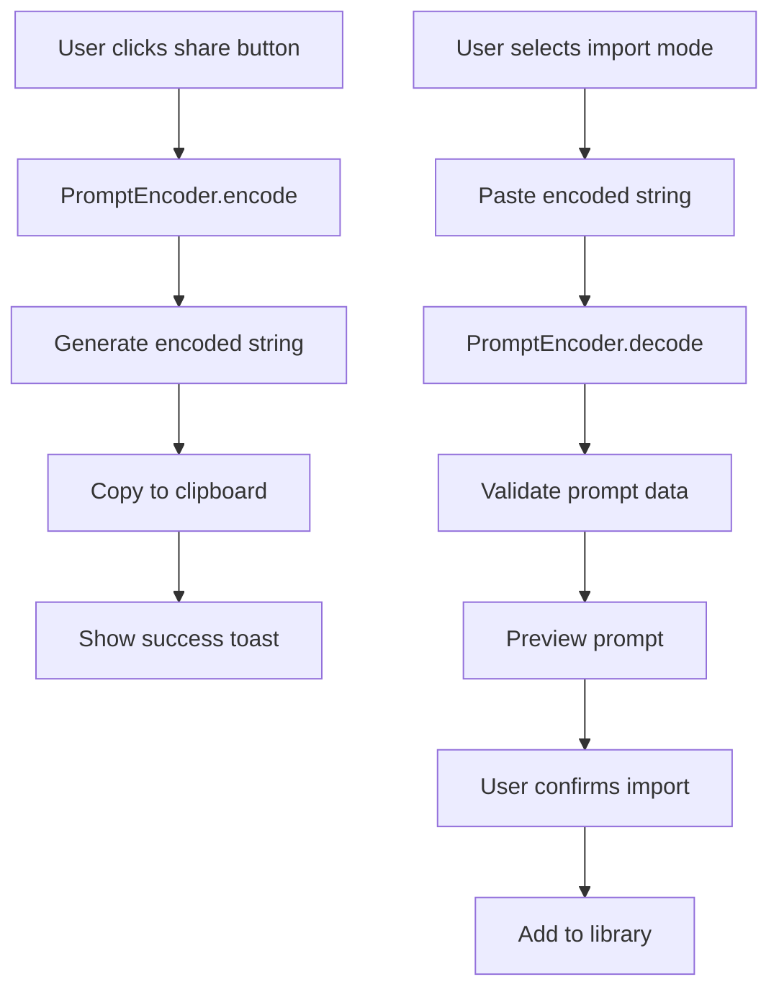

# Design Document

## Overview

The prompt sharing feature enables users to share individual prompts through encoded strings, leveraging the existing `ConfigurationEncoder` infrastructure. This feature adds a share button to prompt cards and extends the add prompt interface to support importing shared prompts, creating a seamless sharing experience similar to custom site configurations.

## Architecture

### Core Components

1. **PromptEncoder Service** - Handles encoding/decoding of prompt data
2. **Enhanced PromptCard Component** - Adds share functionality to existing cards
3. **Enhanced AddPromptForm Component** - Supports both creation and import modes
4. **Shared Prompt Types** - TypeScript interfaces for encoded prompt data

### Data Flow



## Components and Interfaces

### PromptEncoder Service

**Location**: `src/services/promptEncoder.ts`

**Purpose**: Handle secure encoding and decoding of prompt data using the same infrastructure as `ConfigurationEncoder`.

**Key Methods**:
- `encode(prompt: Prompt): Promise<string>` - Encode prompt to shareable string
- `decode(encodedString: string): Promise<SharedPromptData>` - Decode string to prompt data
- `validate(promptData: SharedPromptData): PromptValidationResult` - Validate decoded prompt

**Security Features**:
- Input sanitization using DOMPurify
- Checksum validation for data integrity
- Size limits to prevent abuse
- XSS protection for all text fields

### Enhanced PromptCard Component

**Location**: `src/components/PromptCard.tsx`

**Changes**:
- Add share icon button next to existing copy button
- Implement share functionality with clipboard integration
- Add loading state during encoding
- Show appropriate toast notifications

**UI Design**:
- Share icon: Simple share/export icon (arrow pointing out of box)
- Positioned between copy button and menu button
- Tooltip: "Share this prompt"
- Visual feedback on click (brief highlight/animation)

### Enhanced AddPromptForm Component

**Location**: `src/components/AddPromptForm.tsx`

**Changes**:
- Add mode selector: "Create New" vs "Import Shared"
- Import mode shows text area for encoded string
- Real-time validation and preview of imported prompts
- Category selection for imported prompts

**UI Flow**:
1. Mode selector at top of form
2. Import mode shows:
   - Text area for encoded string
   - Preview section (when valid string detected)
   - Category selector (with existing categories + create new)
   - Import button

### Shared Prompt Types

**Location**: `src/types/index.ts`

**New Interfaces**:

```typescript
export interface SharedPromptData {
  title: string;
  content: string;
  category: string;
  // Metadata excluded for privacy (no IDs, timestamps, etc.)
}

export interface EncodedPromptPayloadV1 {
  v: string; // version
  t: string; // title
  c: string; // content  
  cat: string; // category
  cs: string; // checksum
}

export interface PromptValidationResult {
  isValid: boolean;
  issues: ValidationIssue[];
  sanitizedData: SharedPromptData;
}

export interface ValidationIssue {
  field: string;
  message: string;
  severity: 'error' | 'warning';
}
```

## Data Models

### Encoded Prompt Structure

The encoded prompt will contain only essential, non-sensitive data:

```json
{
  "v": "1.0",           // Version for future compatibility
  "t": "Prompt Title",  // Sanitized title (max 100 chars)
  "c": "Prompt content...", // Sanitized content (max 10000 chars)
  "cat": "Category Name",   // Category name (max 50 chars)
  "cs": "abc123..."     // Integrity checksum
}
```

### Security Considerations

**Data Exclusions**:
- No prompt IDs (prevent conflicts)
- No timestamps (privacy)
- No user-specific metadata
- No system paths or sensitive data

**Validation Rules**:
- Title: 1-100 characters, sanitized
- Content: 1-10000 characters, sanitized
- Category: 1-50 characters, sanitized
- All fields: XSS protection via DOMPurify

## Error Handling

### Encoding Errors

1. **Validation Failure**: Show specific field errors
2. **Encoding Failure**: Show generic "sharing failed" message
3. **Clipboard Failure**: Provide manual copy fallback

### Decoding Errors

1. **Invalid Format**: "Invalid sharing code format"
2. **Corrupted Data**: "Sharing code appears corrupted"
3. **Version Mismatch**: "Sharing code from incompatible version"
4. **Checksum Failure**: "Sharing code integrity check failed"

### User-Friendly Messages

- **Success**: "Prompt sharing code copied to clipboard!"
- **Import Success**: "Prompt imported successfully!"
- **Invalid Code**: "Please check the sharing code and try again"
- **Network Error**: "Unable to process sharing code. Please try again."

## Testing Strategy

### Unit Tests

**PromptEncoder Service**:
- Test encoding/decoding round-trip
- Test validation with invalid data
- Test security sanitization
- Test error handling for malformed input
- Test checksum validation

**Component Tests**:
- Test share button functionality
- Test import mode UI interactions
- Test form validation states
- Test error message display
- Test accessibility features

### Integration Tests

- Test complete sharing workflow (encode → copy → paste → decode → import)
- Test category handling during import
- Test storage integration
- Test clipboard API integration
- Test toast notification system

### E2E Tests

- Test sharing between different browser instances
- Test import with various encoded string formats
- Test error scenarios with user interactions
- Test accessibility with keyboard navigation
- Test responsive design on different screen sizes

## Performance Considerations

### Encoding Performance

- Use existing lz-string compression from ConfigurationEncoder
- Implement encoding in web worker for large prompts (>5KB)
- Cache encoded strings temporarily to avoid re-encoding

### UI Performance

- Debounce import validation (300ms)
- Use React.memo for preview components
- Lazy load import interface components
- Optimize clipboard operations

### Memory Management

- Clear encoded strings from memory after use
- Implement proper cleanup in useEffect hooks
- Avoid storing large encoded strings in component state

## Accessibility

### Keyboard Navigation

- Share button accessible via Tab key
- Import mode fully keyboard navigable
- Screen reader announcements for state changes
- Focus management during mode switching

### Screen Reader Support

- Proper ARIA labels for all interactive elements
- Status announcements for encoding/decoding operations
- Clear error message associations
- Descriptive button labels and tooltips

### Visual Design

- High contrast icons and buttons
- Clear visual hierarchy in import interface
- Loading states with appropriate indicators
- Error states with clear visual cues

## Security Implementation

### Input Sanitization

```typescript
// All text fields sanitized before encoding
const sanitizePromptData = (data: SharedPromptData): SharedPromptData => {
  return {
    title: DOMPurify.sanitize(data.title.trim(), { ALLOWED_TAGS: [] }),
    content: DOMPurify.sanitize(data.content.trim(), { ALLOWED_TAGS: [] }),
    category: DOMPurify.sanitize(data.category.trim(), { ALLOWED_TAGS: [] })
  };
};
```

### Validation Pipeline

1. **Format Validation**: Check string format and structure
2. **Size Validation**: Enforce length limits
3. **Content Sanitization**: Remove potentially harmful content
4. **Checksum Verification**: Ensure data integrity
5. **Business Logic Validation**: Check against prompt rules

### Privacy Protection

- No user identification in shared data
- No system metadata included
- No cross-reference capabilities
- Local-only processing (no external services)