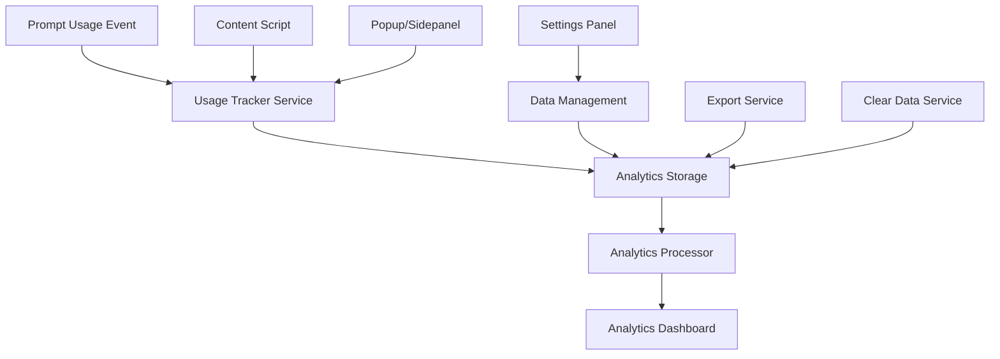

# Design Document - Prompt Usage Analytics

## Overview

The Prompt Usage Analytics feature will provide comprehensive insights into how users interact with their prompt library within the My Prompt Manager Chrome extension. The system will track usage events locally, process analytics data in real-time, and present actionable insights through an intuitive dashboard interface. All data processing and storage will remain local to maintain user privacy and security.

## Architecture

### Data Flow Architecture



### Storage Architecture

**Decision: chrome.storage.local with 3-tier aggregation**

The analytics system will use `chrome.storage.local` (not IndexedDB) for the following reasons:
- Expected data volume: 1,000-10,000 events = ~1-5 MB (well under 10 MB limit)
- Simpler implementation and maintenance
- Works seamlessly across all extension contexts (content scripts, popup, background)
- Already integrated in the extension's architecture
- Adequate performance for the expected scale (<1s for 10k events)

**Three-Tier Aggregation Strategy:**

```typescript
interface AnalyticsStorageData {
  // Tier 1: Raw events (circular buffer - max 1000 events)
  analytics_raw: {
    events: UsageEvent[];
    writeIndex: number;
    maxSize: 1000;
  };

  // Tier 2: Hourly aggregates (keep 30 days = 720 hours)
  analytics_hourly_YYYY_MM: Record<string, HourlyStats>;

  // Tier 3: Daily aggregates (keep 365 days)
  analytics_daily_YYYY: Record<string, DailyStats>;

  // Metadata
  analytics_meta: {
    lastCleanup: number;
    oldestEvent: number;
    totalEvents: number;
    lastAggregation: number;
  };

  // Settings
  analytics_settings: AnalyticsSettings;
}

interface HourlyStats {
  count: number;
  byPlatform: Record<string, number>;
  byCategory: Record<string, number>;
  uniquePrompts: string[];
}

interface DailyStats {
  count: number;
  byPlatform: Record<string, number>;
  byCategory: Record<string, number>;
  topPrompts: Array<{ id: string; count: number }>;
  uniquePrompts: number;
}
```

**Storage Size Estimation:**
- Raw events (1000 max): ~150 KB
- Hourly aggregates (720 hours): ~50 KB
- Daily aggregates (365 days): ~30 KB
- Total: ~240 KB (2.4% of 10 MB quota)

### Component Architecture

- **Analytics Tracker**: Captures usage events from content scripts and UI interactions
- **Analytics Processor**: Aggregates raw events into meaningful insights
- **Analytics Dashboard**: Presents data through charts and statistics
- **Data Manager**: Handles export, import, and cleanup operations

## Components and Interfaces

### Core Data Models

```typescript
interface UsageEvent {
  id: string;
  promptId: string;
  timestamp: number;
  platform: string; // 'claude', 'chatgpt', 'perplexity', 'custom-site', etc.
  category: string; // Category at time of use
  sessionId: string; // Browser session identifier
}

interface AnalyticsSettings {
  trackingEnabled: boolean;
  retentionDays: number; // Default: 365 days
  includeCustomSites: boolean;
  anonymizeData: boolean;
  betaOptIn?: boolean; // For gradual feature rollout
  migrationComplete?: boolean; // First-time setup flag
  onboardingShown?: boolean; // Tutorial for analytics dashboard
}

interface UsageStatistics {
  totalUsage: number;
  uniquePromptsUsed: number;
  averageUsagePerDay: number;
  mostUsedPrompt: PromptUsageStats;
  leastUsedPrompts: PromptUsageStats[];
  platformBreakdown: PlatformUsageStats[];
  categoryBreakdown: CategoryUsageStats[];
  timeSeriesData: TimeSeriesPoint[];
}

interface PromptUsageStats {
  promptId: string;
  promptTitle: string;
  category: string;
  usageCount: number;
  lastUsed: number;
  firstUsed: number;
  platforms: string[];
  trend: 'increasing' | 'decreasing' | 'stable';
}

interface PlatformUsageStats {
  platform: string;
  displayName: string;
  usageCount: number;
  percentage: number;
  uniquePrompts: number;
  averageUsagePerPrompt: number;
}

interface CategoryUsageStats {
  categoryName: string;
  usageCount: number;
  percentage: number;
  uniquePrompts: number;
  lastUsed: number;
  trend: 'increasing' | 'decreasing' | 'stable';
}

interface TimeSeriesPoint {
  date: string; // ISO date string
  usageCount: number;
  uniquePrompts: number;
  platforms: Record<string, number>;
}
```

### Service Layer Components

#### AnalyticsTracker Service

```typescript
class AnalyticsTracker {
  private eventQueue: UsageEvent[] = [];
  private readonly BATCH_SIZE = 50;
  private readonly FLUSH_INTERVAL = 5000; // 5 seconds
  private flushTimer: number | null = null;

  // Track prompt usage from content scripts
  async trackPromptUsage(promptId: string, platform: string): Promise<void>

  // Track usage from popup/sidepanel
  async trackPromptCopy(promptId: string): Promise<void>

  // Batch event queuing (auto-flush at BATCH_SIZE or FLUSH_INTERVAL)
  private queueEvent(event: UsageEvent): void

  // Flush queued events to storage
  private async flush(): Promise<void>

  // Generate session ID for grouping related usage
  private generateSessionId(): string

  // Validate and sanitize tracking data
  private validateUsageEvent(event: Partial<UsageEvent>): boolean
}
```

#### AnalyticsProcessor Service

```typescript
class AnalyticsProcessor {
  private cache: Map<string, { data: any; expires: number }> = new Map();
  private readonly CACHE_TTL = 300000; // 5 minutes

  // Process raw events into aggregated statistics
  async processAnalytics(timeRange?: TimeRange): Promise<UsageStatistics>

  // Incremental aggregation - only process new events since last aggregation
  async aggregateNewEvents(): Promise<void>

  // Calculate usage trends for prompts and categories
  // Formula: Compare last 7 days vs previous 7 days
  // > +10% = 'increasing', < -10% = 'decreasing', else 'stable'
  private calculateTrends(events: UsageEvent[]): TrendData

  // Generate time series data for charts
  private generateTimeSeriesData(events: UsageEvent[], granularity: 'day' | 'week' | 'month'): TimeSeriesPoint[]

  // Rollup old hourly data into daily summaries (after 30 days)
  async rollupHourlyToDaily(month: string): Promise<void>

  // Clean up old events based on retention settings
  async cleanupOldEvents(): Promise<void>

  // Get cached statistics (5-minute TTL)
  private getCachedStats(key: string): UsageStatistics | null
}
```

#### AnalyticsStorage Service

```typescript
class AnalyticsStorage extends StorageManager {
  // Circular buffer operations
  async addEventToCircularBuffer(event: UsageEvent): Promise<void>
  async getCircularBuffer(): Promise<UsageEvent[]>

  // Aggregated data operations
  async getHourlyStats(month: string): Promise<Record<string, HourlyStats>>
  async updateHourlyStats(month: string, stats: Record<string, HourlyStats>): Promise<void>
  async getDailyStats(year: string): Promise<Record<string, DailyStats>>
  async updateDailyStats(year: string, stats: Record<string, DailyStats>): Promise<void>

  // Analytics settings
  async getAnalyticsSettings(): Promise<AnalyticsSettings>
  async updateAnalyticsSettings(settings: Partial<AnalyticsSettings>): Promise<void>

  // Metadata
  async getAnalyticsMeta(): Promise<AnalyticsMeta>
  async updateAnalyticsMeta(meta: Partial<AnalyticsMeta>): Promise<void>

  // Data management
  async exportAnalyticsData(): Promise<AnalyticsExport>
  async importAnalyticsData(data: AnalyticsExport): Promise<void>
  async clearAnalyticsData(options?: ClearOptions): Promise<void>

  // Storage quota monitoring
  async getAnalyticsStorageUsage(): Promise<{ bytes: number; percentage: number }>
  async checkQuotaAndCleanup(): Promise<void>
}

interface ClearOptions {
  clearRawEvents?: boolean;
  clearAggregates?: boolean;
  beforeTimestamp?: number;
  platforms?: string[];
}
```

### UI Components

#### AnalyticsDashboard Component

```typescript
interface AnalyticsDashboardProps {
  timeRange: TimeRange;
  onTimeRangeChange: (range: TimeRange) => void;
}

// Main dashboard container with overview statistics
const AnalyticsDashboard: React.FC<AnalyticsDashboardProps>
```

#### UsageChart Component

```typescript
interface UsageChartProps {
  data: TimeSeriesPoint[];
  type: 'line' | 'bar';
  height?: number;
  showPlatforms?: boolean;
}

// Interactive chart for usage trends over time
const UsageChart: React.FC<UsageChartProps>
```

#### PromptUsageTable Component

```typescript
interface PromptUsageTableProps {
  prompts: PromptUsageStats[];
  sortBy: 'usage' | 'recent' | 'alphabetical';
  onSortChange: (sort: string) => void;
  onPromptClick: (promptId: string) => void;
}

// Sortable table showing prompt usage statistics
const PromptUsageTable: React.FC<PromptUsageTableProps>
```

#### PlatformBreakdown Component

```typescript
interface PlatformBreakdownProps {
  platforms: PlatformUsageStats[];
  showPercentages: boolean;
}

// Visual breakdown of usage by platform (pie chart or bar chart)
const PlatformBreakdown: React.FC<PlatformBreakdownProps>
```

## Data Models

### Storage Schema Extension

The analytics feature will extend the existing storage schema:

```typescript
// Extend existing StorageData interface
interface ExtendedStorageData extends StorageData {
  analytics: {
    usageEvents: UsageEvent[];
    settings: AnalyticsSettings;
    lastCleanup: number;
  };
}
```

### Event Tracking Schema

Usage events will be stored with the following structure:

```typescript
interface UsageEvent {
  id: string; // UUID for unique identification
  promptId: string; // Reference to the used prompt
  timestamp: number; // Unix timestamp of usage
  platform: string; // Platform identifier
  category: string; // Category at time of use (for historical accuracy)
  sessionId: string; // Browser session for grouping
  metadata?: {
    customSiteHostname?: string; // For custom sites
    userAgent?: string; // Browser info (optional)
  };
}
```

### Analytics Aggregation Schema

Processed analytics will be computed on-demand from raw events:

```typescript
interface ComputedAnalytics {
  timeRange: TimeRange;
  computedAt: number;
  statistics: UsageStatistics;
  cacheExpiry: number; // For performance optimization
}
```

## Error Handling

### Error Types

```typescript
enum AnalyticsErrorType {
  TRACKING_DISABLED = 'TRACKING_DISABLED',
  STORAGE_QUOTA_EXCEEDED = 'STORAGE_QUOTA_EXCEEDED',
  DATA_PROCESSING_ERROR = 'DATA_PROCESSING_ERROR',
  EXPORT_ERROR = 'EXPORT_ERROR',
  IMPORT_ERROR = 'IMPORT_ERROR'
}

interface AnalyticsError extends AppError {
  type: AnalyticsErrorType;
  context?: {
    eventId?: string;
    promptId?: string;
    platform?: string;
  };
}
```

### Error Handling Strategy

1. **Graceful Degradation**: If analytics tracking fails, the core prompt functionality continues unaffected
2. **User Notification**: Clear error messages for storage issues with actionable solutions
3. **Automatic Recovery**: Retry mechanisms for transient failures
4. **Data Integrity**: Validation and sanitization of all analytics data
5. **Fallback Modes**: Basic statistics when full processing fails

### Storage Quota Management

- Monitor storage usage and warn users at 80% capacity
- Implement automatic cleanup of old events based on retention settings
- Provide manual cleanup options with clear impact explanations
- Prioritize core prompt data over analytics data in storage allocation

## Testing Strategy

### Unit Testing

1. **Service Layer Tests**
   - AnalyticsTracker: Event creation, validation, and storage
   - AnalyticsProcessor: Data aggregation and trend calculation
   - AnalyticsStorage: CRUD operations and data integrity

2. **Component Tests**
   - Dashboard rendering with various data states
   - Chart components with different data sets
   - User interaction handling (sorting, filtering, time range selection)

3. **Data Processing Tests**
   - Time series generation accuracy
   - Trend calculation algorithms
   - Data cleanup and retention logic

### Integration Testing

1. **End-to-End Usage Tracking**
   - Prompt usage in content scripts triggers analytics
   - Data flows correctly from tracking to dashboard
   - Cross-platform usage tracking accuracy

2. **Storage Integration**
   - Analytics data coexists with existing prompt data
   - Storage quota handling and cleanup
   - Export/import functionality with analytics data

3. **Performance Testing**
   - Dashboard loading with large datasets
   - Real-time analytics processing performance
   - Memory usage during extended tracking periods

### Chrome Extension Testing

1. **Content Script Integration**
   - Analytics tracking across different AI platforms
   - Custom site tracking functionality
   - Session management across page navigations

2. **Cross-Context Communication**
   - Message passing between content scripts and extension contexts
   - Data synchronization between popup and sidepanel
   - Background service worker analytics processing

3. **Storage API Testing**
   - Chrome storage API integration
   - Quota exceeded scenarios (fill storage to 9.5 MB, verify cleanup)
   - Data persistence across browser sessions
   - Circular buffer edge cases (exactly 1000 events, overflow handling)

4. **Performance Benchmarks**
   - 10,000 events aggregation in < 200ms
   - Dashboard load with 365 days of data in < 500ms
   - Storage quota check in < 10ms
   - Batch write (100 events) in < 50ms

5. **Migration & Upgrade Testing**
   - First-time users without analytics data (onboarding)
   - Existing users upgrading to analytics feature
   - Settings migration and data integrity
   - Backwards compatibility with older extension versions

### Privacy and Security Testing

1. **Data Isolation**
   - No external data transmission
   - Local storage encryption (if implemented)
   - User data anonymization options

2. **Input Sanitization**
   - Platform name validation
   - Custom site hostname sanitization
   - Event data validation and sanitization

## Performance Considerations

### Data Processing Optimization

1. **Lazy Loading**: Load analytics data only when dashboard is accessed
2. **Caching**: Cache computed statistics with appropriate expiry times
3. **Batch Processing**: Process multiple events together for efficiency
4. **Background Processing**: Use service worker for heavy computations

### Storage Optimization

1. **Event Compression**: Store events efficiently with minimal metadata
2. **Automatic Cleanup**: Remove old events based on retention settings
3. **Incremental Processing**: Process only new events since last computation
4. **Storage Monitoring**: Track and report storage usage to users

### UI Performance

1. **Virtual Scrolling**: Handle large prompt lists efficiently
2. **Chart Optimization**: Use efficient charting libraries with good performance
3. **Debounced Updates**: Prevent excessive re-renders during user interactions
4. **Progressive Loading**: Load dashboard sections incrementally

## Security Considerations

### Data Privacy

1. **Local Storage Only**: All analytics data remains on user's device
2. **No External APIs**: No data transmission to external services
3. **User Control**: Complete user control over data retention and deletion
4. **Anonymization Options**: Optional data anonymization features

### Input Validation

1. **Event Sanitization**: Validate all usage event data before storage
2. **Platform Validation**: Whitelist known platforms and validate custom sites
3. **Data Integrity**: Ensure analytics data cannot corrupt core prompt data
4. **XSS Prevention**: Sanitize all user-generated content in analytics displays

### Extension Security

1. **Content Script Isolation**: Secure communication between contexts
2. **Permission Minimization**: Request only necessary permissions
3. **CSP Compliance**: Ensure all analytics UI complies with Content Security Policy
4. **Secure Storage**: Use Chrome's secure storage APIs appropriately

---

## Technical Decisions

### Storage Strategy

**Choice: chrome.storage.local with 3-tier aggregation**

**Rationale:**
- Data volume: 1,000-10,000 events = ~1-5 MB (well under 10 MB limit)
- Simpler codebase (~300 lines vs ~800 for IndexedDB)
- Better cross-context access (content scripts, popup, background)
- Already integrated in extension architecture
- Adequate performance (<1s for 10k events)

**Migration Threshold to IndexedDB:**
- Storage usage > 8 MB (80% of quota)
- Dashboard load time > 1s
- Events per day > 200
- Aggregation time > 100ms

**Tier Architecture:**
```typescript
// Tier 1: Raw events (circular buffer, max 1000)
analytics_raw: { events: UsageEvent[], writeIndex: number }

// Tier 2: Hourly aggregates (keep 30 days)
analytics_hourly_2025_10: Record<string, HourlyStats>

// Tier 3: Daily aggregates (keep 365 days)
analytics_daily_2025: Record<string, DailyStats>
```

**Retention & Cleanup:**
- Raw events: 1000 max (circular overwrite)
- Hourly data: 30 days → rollup to daily
- Daily data: 365 days → delete oldest
- Auto-cleanup at 80% storage quota

### Chart Library Selection

**Primary: Lightweight Charts (TradingView)**
- Bundle size: 35 KB (smallest option)
- Use case: Time-series line charts, area charts
- CSP compliant: Canvas-based, no inline styles
- Performance: Excellent with 10k+ data points

**Secondary: uPlot**
- Bundle size: 48 KB
- Use case: General charts, bar charts
- CSP compliant: Canvas-based
- Performance: 10% CPU for 3600 points at 60fps

**For Pie Charts: Chart.js (with tree-shaking)**
- Bundle size: ~50-70 KB (selective imports only)
- Use case: Platform/category breakdown
- CSP workaround: Wrap in sized container div
- Total impact: ~83 KB added to bundle

**Avoided:**
- Recharts (139 KB, React overhead)
- ECharts (1 MB, too large)
- ApexCharts (170 KB, performance issues)

### UX Patterns

#### Time Range Selector
```typescript
interface TimeRangeConfig {
  presets: ['7d', '30d', '90d', '1y', 'custom'];
  placement: 'top-right'; // Standard position
  defaultValue: '30d';
}
```

#### Empty State Design
```typescript
interface EmptyStateConfig {
  icon: 'chart-line-icon';
  title: 'No usage data yet';
  message: 'Start using prompts to see your analytics appear here';
  cta: {
    label: 'View Prompt Library';
    action: 'navigate-to-prompts';
  };
}
```

#### Privacy Indicator
```typescript
interface PrivacyBadge {
  text: 'Local Only 🔒';
  tooltip: 'All analytics stored on your device. Never transmitted.';
  placement: 'dashboard-header';
  color: 'green';
}
```

#### Number Formatting
```typescript
// Display standards
1234 → "1.2k"
1234567 → "1.2M"
0.12345 → "12.3%" // For percentages
```

#### Clear Data Confirmation Pattern
```typescript
interface DestructiveActionDialog {
  title: 'Delete All Analytics Data?'; // Question format
  warning: 'This action cannot be undone'; // Red label
  details: 'This will permanently delete 1,247 usage records'; // Specific consequences
  confirmButton: {
    label: 'Delete Analytics';
    color: 'red';
    requiresTyping: false; // For critical data: true with "Type DELETE to confirm"
  };
  cancelButton: {
    label: 'Cancel';
    color: 'gray';
    default: true;
  };
}
```

### Export/Import Specification

#### Export Format
```typescript
interface AnalyticsExport {
  version: '1.0';
  exportedAt: string; // ISO timestamp
  extension: {
    version: string;
    name: 'My Prompt Manager';
  };
  data: {
    rawEvents?: UsageEvent[]; // Optional: large
    aggregates: {
      hourly: Record<string, HourlyStats>;
      daily: Record<string, DailyStats>;
      platform: PlatformUsageStats[];
      prompt: PromptUsageStats[];
    };
  };
  metadata: {
    totalEvents: number;
    dateRange: { start: string; end: string };
    exportedBy: string; // Extension version
  };
}
```

#### Supported Formats
- **Primary: CSV** (Excel compatibility, most expected)
- **Secondary: JSON** (Developer-friendly, complete data)

#### Export UI
```typescript
interface ExportConfig {
  button: {
    label: 'Export';
    placement: 'top-right';
    dropdown: ['Export CSV', 'Export JSON'];
  };
  options: {
    includeRawEvents: boolean; // Default: false (reduces file size)
    timeRange: '7d' | '30d' | '90d' | '1y' | 'all';
  };
}
```

### Quota Management Strategy

```typescript
interface QuotaManagement {
  monitoring: {
    checkFrequency: 'on-write'; // Check on every write operation
    warningThreshold: 0.8; // Warn at 80% (8 MB)
    criticalThreshold: 0.95; // Force cleanup at 95% (9.5 MB)
  };

  autoCleanup: {
    triggers: [
      'quota-threshold-exceeded',
      'scheduled-weekly',
      'user-initiated'
    ];
    actions: [
      'rollup-hourly-to-daily', // 30+ day old hourly data
      'delete-old-daily', // 365+ day old daily data
      'trim-raw-events' // Keep only last 1000
    ];
  };

  userNotification: {
    showWarning: true;
    message: 'Analytics storage is at {percentage}%. Old data will be automatically archived.';
    actions: ['View Details', 'Clear Old Data', 'Dismiss'];
  };
}
```

### Performance Targets

```typescript
interface PerformanceTargets {
  tracking: {
    eventCapture: '< 5ms'; // Overhead per event
    batchWrite: '< 50ms'; // Write 50-100 events
  };

  processing: {
    aggregation: '< 100ms'; // Incremental aggregation
    statsComputation: '< 200ms'; // Dashboard statistics
  };

  ui: {
    dashboardLoad: '< 500ms'; // Initial load
    chartRender: '< 300ms'; // Chart rendering
    interactiveUpdate: '< 100ms'; // Filter/sort operations
  };

  storage: {
    quotaCheck: '< 10ms'; // Storage usage check
    cleanup: '< 1s'; // Automatic cleanup
  };
}
```