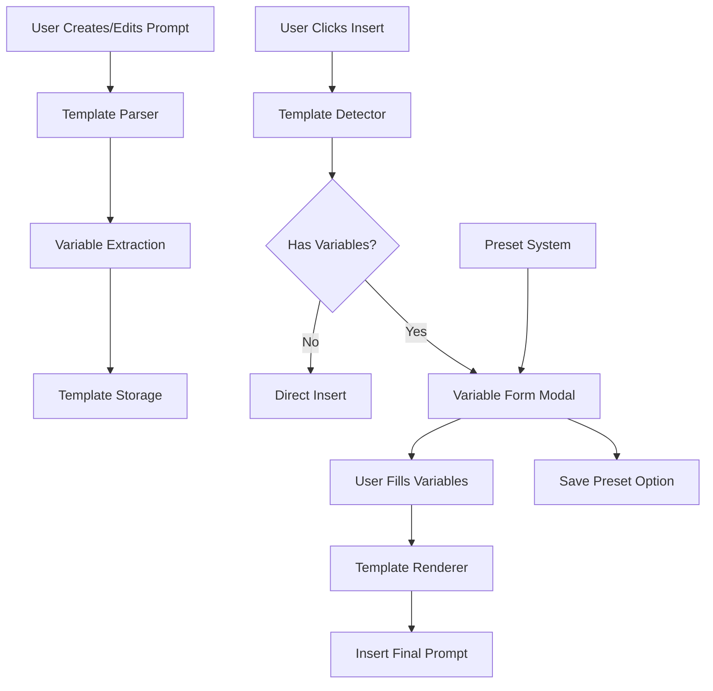
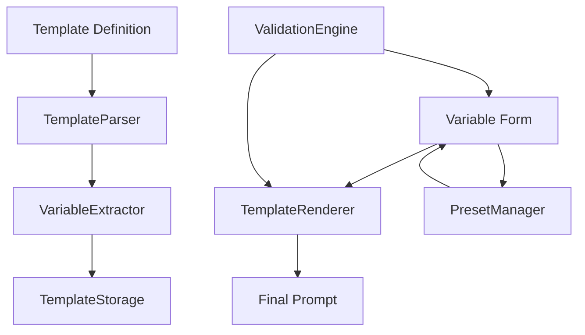

# Design Document - Smart Prompt Templates with Variables

## Overview

The Smart Prompt Templates with Variables feature will transform the My Prompt Manager extension from a static prompt library into a dynamic template system. Users will be able to create prompts with placeholder variables using a simple double curly brace syntax ({{variable_name}}), then fill in these variables through an intuitive form interface before insertion. The system will support multiple variable types, default values, validation, and preset management to create a powerful yet user-friendly templating experience.

## Architecture

### Template Processing Flow



### Data Flow Architecture



## Components and Interfaces

### Core Data Models

```typescript
interface PromptTemplate extends Prompt {
  isTemplate: boolean;
  variables: TemplateVariable[];
  templateContent: string; // Original content with {{}} syntax
  presets: TemplatePreset[];
}

interface TemplateVariable {
  name: string;
  type: 'text' | 'number' | 'dropdown' | 'textarea';
  required: boolean;
  defaultValue?: string;
  description?: string;
  options?: string[]; // For dropdown type
  validation?: VariableValidation;
}

interface VariableValidation {
  minLength?: number;
  maxLength?: number;
  pattern?: string; // Regex pattern
  min?: number; // For number type
  max?: number; // For number type
}

interface TemplatePreset {
  id: string;
  name: string;
  description?: string;
  values: Record<string, string>; // variable_name -> value
  createdAt: number;
  lastUsed: number;
}

interface VariableFormData {
  templateId: string;
  values: Record<string, string>;
  selectedPreset?: string;
}

interface TemplateRenderResult {
  success: boolean;
  renderedContent: string;
  errors?: TemplateError[];
}

interface TemplateError {
  type: 'MISSING_VARIABLE' | 'INVALID_SYNTAX' | 'VALIDATION_ERROR';
  variable?: string;
  message: string;
}
```

### Template Syntax Specification

The system will use a custom syntax inspired by Mustache/Handlebars but simplified for user-friendliness:

```typescript
// Basic variable
{{variable_name}}

// Variable with default value
{{variable_name=default_value}}

// Required variable (asterisk)
{{variable_name*}}

// Variable with type specification
{{variable_name:number}}
{{variable_name:textarea}}

// Dropdown variable with options
{{variable_name|option1,option2,option3}}

// Variable with description/help text
{{variable_name|description:"Help text for this variable"}}

// Combined syntax (order matters: name, type, required, default, options, description)
{{project_name*=MyProject|description:"The name of your project"}}
{{priority:number*=1|1,2,3,4,5|description:"Priority level from 1-5"}}
{{feedback_type|positive,negative,neutral|description:"Type of feedback to provide"}}
```

### Service Layer Components

#### TemplateParser Service

```typescript
class TemplateParser {
  private readonly VARIABLE_REGEX = /\{\{([^}]+)\}\}/g;
  private readonly SYNTAX_PATTERNS = {
    name: /^([a-zA-Z_][a-zA-Z0-9_]*)/,
    type: /:([a-zA-Z]+)/,
    required: /\*/,
    default: /=([^|]*)/,
    options: /\|([^|]*?)(?:\|description:|$)/,
    description: /description:"([^"]*?)"/
  };

  // Parse template content and extract variables
  parseTemplate(content: string): TemplateParseResult

  // Validate template syntax
  validateTemplateSyntax(content: string): TemplateValidationResult

  // Extract all variables from template content
  extractVariables(content: string): TemplateVariable[]

  // Parse individual variable definition
  private parseVariableDefinition(definition: string): TemplateVariable

  // Validate variable name (alphanumeric + underscore, no spaces)
  private validateVariableName(name: string): boolean

  // Sanitize variable options for dropdown
  private sanitizeOptions(options: string): string[]
}

interface TemplateParseResult {
  isTemplate: boolean;
  variables: TemplateVariable[];
  errors: TemplateError[];
  warnings: string[];
}
```

#### TemplateRenderer Service

```typescript
class TemplateRenderer {
  // Render template with provided variable values
  renderTemplate(template: PromptTemplate, values: Record<string, string>): TemplateRenderResult

  // Validate variable values against template requirements
  validateVariableValues(template: PromptTemplate, values: Record<string, string>): ValidationResult

  // Replace template variables with actual values
  private replaceVariables(content: string, values: Record<string, string>): string

  // Apply variable type-specific formatting
  private formatVariableValue(variable: TemplateVariable, value: string): string

  // Escape special characters in variable values
  private escapeVariableValue(value: string): string
}

interface ValidationResult {
  isValid: boolean;
  errors: FieldValidationError[];
}

interface FieldValidationError {
  field: string;
  message: string;
  type: 'required' | 'invalid_type' | 'out_of_range' | 'pattern_mismatch';
}
```

#### TemplatePresetManager Service

```typescript
class TemplatePresetManager extends StorageManager {
  // Get all presets for a template
  async getPresetsForTemplate(templateId: string): Promise<TemplatePreset[]>

  // Save a new preset
  async savePreset(templateId: string, preset: Omit<TemplatePreset, 'id' | 'createdAt'>): Promise<TemplatePreset>

  // Update existing preset
  async updatePreset(presetId: string, updates: Partial<TemplatePreset>): Promise<void>

  // Delete preset
  async deletePreset(presetId: string): Promise<void>

  // Get most recently used presets (for quick access)
  async getRecentPresets(templateId: string, limit: number = 5): Promise<TemplatePreset[]>

  // Update preset usage timestamp
  async markPresetUsed(presetId: string): Promise<void>

  // Clean up unused presets (older than 90 days, never used)
  async cleanupUnusedPresets(): Promise<void>
}
```

### UI Components

#### VariableFormModal Component

```typescript
interface VariableFormModalProps {
  template: PromptTemplate;
  isOpen: boolean;
  onSubmit: (values: Record<string, string>) => void;
  onCancel: () => void;
  onSavePreset?: (name: string, values: Record<string, string>) => void;
}

// Modal dialog for filling template variables
const VariableFormModal: React.FC<VariableFormModalProps>
```

**Modal Design Specifications:**
- **Size**: Medium modal (600px width, auto height)
- **Header**: Template name + "Fill Variables" title
- **Body**: Form with variable inputs, preset selector
- **Footer**: Cancel, Save Preset (optional), Insert Prompt buttons
- **Validation**: Real-time validation with error messages
- **Accessibility**: Proper ARIA labels, keyboard navigation

#### VariableInput Component

```typescript
interface VariableInputProps {
  variable: TemplateVariable;
  value: string;
  onChange: (value: string) => void;
  error?: string;
  disabled?: boolean;
}

// Individual input component for each variable type
const VariableInput: React.FC<VariableInputProps>
```

**Input Type Mapping:**
- **text**: Standard text input (default)
- **textarea**: Multi-line text area (3-4 rows)
- **number**: Number input with min/max validation
- **dropdown**: Select dropdown with options

#### PresetSelector Component

```typescript
interface PresetSelectorProps {
  templateId: string;
  presets: TemplatePreset[];
  selectedPreset?: string;
  onPresetSelect: (preset: TemplatePreset | null) => void;
  onPresetDelete?: (presetId: string) => void;
}

// Dropdown for selecting saved presets
const PresetSelector: React.FC<PresetSelectorProps>
```

#### TemplateIndicator Component

```typescript
interface TemplateIndicatorProps {
  template: PromptTemplate;
  size?: 'small' | 'medium' | 'large';
  showVariableCount?: boolean;
}

// Badge/icon to indicate a prompt is a template
const TemplateIndicator: React.FC<TemplateIndicatorProps>
```

**Visual Design:**
- **Icon**: Template/variable icon (e.g., `{{}}` symbol)
- **Badge**: "Template" text with variable count
- **Color**: Distinct color (blue/purple) to differentiate from regular prompts
- **Tooltip**: "Template with X variables" on hover

#### TemplatePreview Component

```typescript
interface TemplatePreviewProps {
  template: PromptTemplate;
  highlightVariables?: boolean;
  showVariableList?: boolean;
}

// Preview of template with highlighted variables
const TemplatePreview: React.FC<TemplatePreviewProps>
```

## Data Models

### Storage Schema Extension

```typescript
// Extend existing Prompt interface
interface ExtendedPrompt extends Prompt {
  // Template-specific fields
  isTemplate?: boolean;
  templateContent?: string; // Original with {{}} syntax
  variables?: TemplateVariable[];
  
  // Metadata
  templateVersion?: string; // For future migrations
  lastTemplateUpdate?: number;
}

// New storage keys for template system
interface TemplateStorageData {
  template_presets: Record<string, TemplatePreset[]>; // templateId -> presets
  template_settings: TemplateSettings;
  template_usage_stats: TemplateUsageStats; // For analytics integration
}

interface TemplateSettings {
  enableTemplates: boolean;
  showTemplateIndicators: boolean;
  autoSavePresets: boolean;
  maxPresetsPerTemplate: number; // Default: 10
  presetRetentionDays: number; // Default: 90
}

interface TemplateUsageStats {
  templateUsageCount: Record<string, number>; // templateId -> usage count
  presetUsageCount: Record<string, number>; // presetId -> usage count
  mostUsedVariables: Record<string, number>; // variable name -> usage count
}
```

### Template Migration Strategy

```typescript
interface TemplateMigration {
  // Convert existing prompts to templates if they contain {{}} syntax
  migrateExistingPrompts(): Promise<MigrationResult>
  
  // Validate all templates after migration
  validateAllTemplates(): Promise<ValidationSummary>
  
  // Backup original prompts before migration
  backupPromptsBeforeMigration(): Promise<void>
}

interface MigrationResult {
  totalPrompts: number;
  convertedToTemplates: number;
  errors: string[];
  warnings: string[];
}
```

## Error Handling

### Template Error Types

```typescript
enum TemplateErrorType {
  INVALID_SYNTAX = 'INVALID_SYNTAX',
  MISSING_VARIABLE = 'MISSING_VARIABLE',
  INVALID_VARIABLE_NAME = 'INVALID_VARIABLE_NAME',
  VALIDATION_ERROR = 'VALIDATION_ERROR',
  PRESET_NOT_FOUND = 'PRESET_NOT_FOUND',
  RENDER_ERROR = 'RENDER_ERROR'
}

interface TemplateError extends AppError {
  type: TemplateErrorType;
  context?: {
    templateId?: string;
    variableName?: string;
    presetId?: string;
    line?: number;
    column?: number;
  };
}
```

### Error Handling Strategy

1. **Graceful Degradation**: If template parsing fails, treat as regular prompt
2. **User-Friendly Messages**: Clear error messages with suggestions for fixes
3. **Validation Feedback**: Real-time validation in template editor
4. **Recovery Options**: Allow users to fix syntax errors inline
5. **Fallback Behavior**: If variable form fails, show raw template for manual editing

### Template Validation Rules

```typescript
interface TemplateValidationRules {
  // Variable name validation
  variableName: {
    pattern: /^[a-zA-Z_][a-zA-Z0-9_]*$/;
    maxLength: 50;
    reservedNames: ['template', 'preset', 'system'];
  };
  
  // Template content validation
  content: {
    maxVariables: 20; // Prevent overly complex templates
    maxNestingDepth: 3; // For future nested variable support
    maxContentLength: 10000; // Reasonable limit
  };
  
  // Variable value validation
  values: {
    maxLength: 1000; // Per variable value
    allowedCharacters: /^[^<>{}]*$/; // Prevent injection
  };
}
```

## Testing Strategy

### Unit Testing

1. **TemplateParser Tests**
   - Variable extraction accuracy
   - Syntax validation
   - Error handling for malformed templates
   - Edge cases (empty variables, special characters)

2. **TemplateRenderer Tests**
   - Variable replacement accuracy
   - Type-specific formatting
   - Validation logic
   - Error scenarios (missing variables, invalid values)

3. **PresetManager Tests**
   - CRUD operations
   - Storage integration
   - Cleanup logic
   - Concurrent access handling

4. **UI Component Tests**
   - Form validation
   - User interactions
   - Error display
   - Accessibility compliance

### Integration Testing

1. **End-to-End Template Flow**
   - Create template → Fill variables → Insert prompt
   - Preset creation and usage
   - Template editing and updates

2. **Storage Integration**
   - Template data persistence
   - Migration from regular prompts
   - Export/import with templates

3. **Platform Integration**
   - Template insertion across all AI platforms
   - Variable form modal behavior
   - Content script compatibility

### Template-Specific Testing

1. **Syntax Parsing**
   - Test all supported syntax variations
   - Malformed syntax handling
   - Complex nested scenarios

2. **Variable Types**
   - Text, number, dropdown, textarea inputs
   - Validation for each type
   - Default value handling

3. **Preset System**
   - Save/load presets
   - Preset management UI
   - Cleanup of old presets

## Performance Considerations

### Template Processing Optimization

1. **Parsing Efficiency**
   - Cache parsed templates to avoid re-parsing
   - Lazy parsing (only when needed)
   - Efficient regex patterns for variable extraction

2. **Rendering Performance**
   - Simple string replacement (no complex templating engine)
   - Minimal DOM manipulation in variable form
   - Debounced validation to avoid excessive processing

3. **Storage Optimization**
   - Store parsed variables separately from content
   - Compress preset data for frequently used templates
   - Limit preset storage per template

### UI Performance

1. **Modal Loading**
   - Pre-load variable form components
   - Lazy load preset data
   - Optimize form rendering for many variables

2. **Template Indicators**
   - Efficient template detection
   - Cached template status
   - Minimal visual overhead

## Security Considerations

### Input Sanitization

1. **Variable Content**
   - Sanitize all variable values before insertion
   - Prevent script injection through variables
   - Validate variable names to prevent conflicts

2. **Template Syntax**
   - Restrict variable syntax to prevent code execution
   - Validate template content before parsing
   - Escape special characters in rendered output

3. **Preset Security**
   - Validate preset data before storage
   - Prevent preset name conflicts
   - Sanitize preset descriptions

### Data Privacy

1. **Local Storage**: All template data remains local (consistent with extension privacy)
2. **No External Processing**: Template rendering happens entirely client-side
3. **User Control**: Users can delete templates and presets at any time

## Migration and Backwards Compatibility

### Existing Prompt Compatibility

1. **Non-Breaking Changes**: Regular prompts continue to work unchanged
2. **Opt-In Templates**: Users must explicitly create templates (no automatic conversion)
3. **Template Detection**: Automatic detection of {{}} syntax in existing prompts with user confirmation

### Data Migration Strategy

```typescript
interface TemplateMigrationPlan {
  phase1: {
    description: 'Add template fields to existing prompt schema';
    changes: ['Add isTemplate boolean', 'Add variables array', 'Add templateContent field'];
    riskLevel: 'low';
  };
  
  phase2: {
    description: 'Migrate prompts containing {{}} syntax';
    changes: ['Scan existing prompts', 'Parse variable syntax', 'Convert to templates'];
    riskLevel: 'medium';
    userConfirmation: true;
  };
  
  phase3: {
    description: 'Add preset system';
    changes: ['Add preset storage', 'Add preset UI', 'Add preset management'];
    riskLevel: 'low';
  };
}
```

### Version Compatibility

- **Template Version**: Track template format version for future migrations
- **Backwards Compatibility**: Older extension versions ignore template fields
- **Export/Import**: Include template data in export format with version info

---

## Technical Decisions

### Template Syntax Choice

**Decision: Custom {{}} syntax inspired by Mustache**

**Rationale:**
- **Familiar**: Most users recognize {{}} from other templating systems
- **Simple**: Easy to type and remember
- **Readable**: Clear distinction between template and regular text
- **Extensible**: Can add more features (conditionals, loops) in future
- **Safe**: No code execution, just string replacement

**Alternative Considered:**
- `$variable` syntax (too similar to shell variables)
- `[variable]` syntax (conflicts with markdown)
- `%variable%` syntax (less familiar to users)

### Variable Type System

**Decision: Four core types (text, number, dropdown, textarea)**

**Rationale:**
- **Covers 90% of use cases** without complexity
- **Easy to implement** with standard HTML inputs
- **User-friendly** - no learning curve for basic types
- **Extensible** - can add more types later (date, email, etc.)

**Type Mapping:**
```typescript
text → <input type="text">
number → <input type="number">
dropdown → <select>
textarea → <textarea>
```

### Preset Storage Strategy

**Decision: Store presets per template in chrome.storage.local**

**Rationale:**
- **Logical grouping**: Presets belong to specific templates
- **Storage efficiency**: Only load presets when needed
- **User control**: Easy to delete presets per template
- **Scalability**: Supports many templates with many presets each

**Storage Structure:**
```typescript
template_presets: {
  "template-id-1": [preset1, preset2, ...],
  "template-id-2": [preset3, preset4, ...]
}
```

### Form Validation Strategy

**Decision: Real-time validation with debouncing**

**Rationale:**
- **Better UX**: Immediate feedback on errors
- **Performance**: Debounced to avoid excessive validation
- **Accessibility**: Screen readers can announce validation errors
- **Prevention**: Stops invalid submissions before they happen

**Implementation:**
- 300ms debounce on input changes
- Visual error indicators
- Prevent form submission until valid
- Clear error messages with suggestions

### Template Indicator Design

**Decision: Subtle badge with variable count**

**Rationale:**
- **Non-intrusive**: Doesn't clutter the prompt library
- **Informative**: Shows it's a template and complexity level
- **Consistent**: Matches existing extension design patterns
- **Accessible**: Clear visual distinction for screen readers

**Visual Specification:**
```css
.template-indicator {
  background: #3b82f6; /* Blue */
  color: white;
  font-size: 0.75rem;
  padding: 2px 6px;
  border-radius: 4px;
  display: inline-flex;
  align-items: center;
  gap: 4px;
}
```

### Performance Targets

```typescript
interface TemplatePerformanceTargets {
  parsing: {
    simpleTemplate: '< 5ms'; // Template with 1-5 variables
    complexTemplate: '< 20ms'; // Template with 10+ variables
    syntaxValidation: '< 10ms'; // Real-time validation
  };
  
  rendering: {
    variableReplacement: '< 5ms'; // Replace variables with values
    formGeneration: '< 50ms'; // Generate variable input form
    presetLoading: '< 100ms'; // Load presets for template
  };
  
  ui: {
    modalOpen: '< 200ms'; // Open variable form modal
    formValidation: '< 50ms'; // Validate form inputs (debounced)
    templateIndicator: '< 10ms'; // Show template badge
  };
}
```