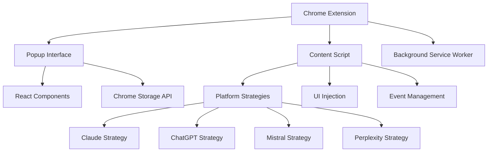

# My Prompt Manager - Chrome Extension

[](https://github.com/spartDev/My-Prompt-Manager)
[](LICENSE)
[](https://www.google.com/chrome/)
[](https://github.com/spartDev/My-Prompt-Manager)

A powerful Chrome extension that provides seamless access to your personal prompt library directly within popular AI chat interfaces. Features both a popup interface for managing prompts and native integration with Claude, ChatGPT, Mistral LeChat, Perplexity, and more.

**Author:** Thomas Roux  
**Repository:** [github.com/spartDev/My-Prompt-Manager](https://github.com/spartDev/My-Prompt-Manager)

## 🚀 Features

### Popup Interface (Prompt Management)
✅ **Smart Prompt Management:** Store, organize, and search your prompts with custom categories  
✅ **Rich Categorization:** Create unlimited categories with custom colors and icons  
✅ **Instant Search:** Real-time filtering with text highlighting across titles and content  
✅ **Quick Actions:** One-click copy to clipboard, edit in-place, and bulk operations  
✅ **Dark Mode Support:** Beautiful dark theme with automatic system preference detection  
✅ **Data Persistence:** Automatic saving using Chrome's storage API with quota monitoring  
✅ **Security First:** DOMPurify sanitization for XSS protection  
✅ **Import/Export:** JSON backup and restore functionality with data portability

### AI Platform Integration
✅ **Native Integration:** Library icon appears seamlessly in AI chat interfaces  
✅ **Smart Positioning:** Context-aware popup placement for optimal UX  
✅ **Universal Compatibility:** Works with textarea and contenteditable elements  
✅ **Keyboard Navigation:** Full keyboard support for accessibility  
✅ **Custom Sites:** Add support for any AI platform through settings  
✅ **Theme Synchronization:** Matches the host platform's theme automatically  
✅ **Side Panel Support:** Chrome 114+ dual interface mode (popup or side panel)

## 🎯 Supported Platforms

| Platform | Status | Domain | Priority |
|----------|--------|--------|----------|
| Claude | ✅ Fully Supported | claude.ai | 100 |
| ChatGPT | ✅ Fully Supported | chatgpt.com | 90 |
| Mistral LeChat | ✅ Fully Supported | chat.mistral.ai | 85 |
| Perplexity | ✅ Fully Supported | www.perplexity.ai | 80 |
| Custom Sites | ✅ Configurable | User-defined | Variable |

**Coming Soon:** Gemini and more! See our [Platform Integration Guide](docs/PLATFORM_INTEGRATION.md) to add your own.

## 💻 Tech Stack

| Technology | Purpose | Version |
|------------|---------|---------|
| **React** | UI Framework | 18.3.1 |
| **TypeScript** | Type Safety | 5.5.3 |
| **Tailwind CSS** | Styling | 3.4.4 |
| **Vite** | Build Tool | 6.3.5 |
| **Vitest** | Testing Framework | 3.2.4 |
| **DOMPurify** | XSS Protection | 3.2.6 |
| **Husky** | Git Hooks | 9.1.7 |
| **@crxjs/vite-plugin** | Chrome Extension Support | 2.0.3 |

## 📦 Installation

### Prerequisites

- [Node.js](https://nodejs.org/) 18+ (LTS recommended)
- [Chrome Browser](https://www.google.com/chrome/) 114+
- [Git](https://git-scm.com/) for cloning the repository

### Development Setup

1. **Clone the repository:**
   ```bash
   git clone https://github.com/spartDev/My-Prompt-Manager.git
   cd My-Prompt-Manager
   ```

2. **Install dependencies:**
   ```bash
   npm install
   ```

3. **Start development server:**
   ```bash
   npm run dev
   ```
   This starts Vite with hot module replacement (HMR) enabled.

4. **Build for production:**
   ```bash
   npm run build
   ```
   Creates an optimized build in the `dist/` folder.

### Loading in Chrome

1. Open Chrome and navigate to `chrome://extensions/`
2. Enable **"Developer mode"** (toggle in top right corner)
3. Click **"Load unpacked"** button
4. Select the `dist` folder from the project
5. The extension icon should appear in your toolbar
6. Pin the extension for easy access (optional)

### Verify Installation

1. Click the extension icon - the popup should open
2. Visit [claude.ai](https://claude.ai) or [chat.mistral.ai](https://chat.mistral.ai) - look for the library icon
3. Try adding a test prompt and using it in an AI chat

## 🛠️ Available Scripts

| Command | Description | Usage |
|---------|-------------|--------|
| `npm run dev` | Start development server with HMR | Development |
| `npm run build` | Create production build | Deployment |
| `npm test` | Run test suite (518+ tests) | Testing |
| `npm run test:ui` | Run tests with Vitest UI | Interactive Testing |
| `npm run test:coverage` | Generate coverage report | Code Coverage |
| `npm run lint` | Run ESLint checks | Code Quality |
| `npm run lint:fix` | Auto-fix ESLint issues | Code Formatting |
| `npm run package` | Package extension for distribution | Chrome Web Store |

## 🏗️ Architecture

### System Overview



### Content Script Architecture (TypeScript Modules)

```
src/content/
├── index.ts                    # Main entry point
├── types/                      # TypeScript definitions
│   ├── platform.ts            # Platform interfaces
│   └── ui.ts                  # UI component types
├── utils/                      # Utility modules
│   ├── logger.ts              # Debug logging
│   ├── storage.ts             # Chrome storage wrapper
│   ├── dom.ts                 # DOM utilities
│   ├── styles.ts              # Style injection
│   └── theme-manager.ts       # Theme synchronization
├── ui/                         # UI components
│   ├── element-factory.ts     # Element creation
│   ├── keyboard-navigation.ts # Keyboard support
│   └── event-manager.ts       # Event handling
├── platforms/                  # Platform-specific strategies
│   ├── base-strategy.ts       # Abstract base class
│   ├── claude-strategy.ts     # Claude.ai implementation
│   ├── chatgpt-strategy.ts    # ChatGPT implementation
│   ├── mistral-strategy.ts    # Mistral LeChat implementation
│   ├── perplexity-strategy.ts # Perplexity implementation
│   └── platform-manager.ts    # Strategy coordinator
└── core/                       # Core functionality
    ├── injector.ts            # Icon injection logic
    └── insertion-manager.ts   # Content insertion handler
```

### Design Patterns

- **Strategy Pattern:** Platform-specific implementations
- **Factory Pattern:** UI element creation
- **Observer Pattern:** Event management and state synchronization
- **Module Pattern:** TypeScript module organization
- **Singleton Pattern:** Platform manager instance

## 📖 User Guide

### Getting Started

1. **First Time Setup:**
   - Install the extension following the installation guide
   - Click the extension icon to open the popup
   - Create your first category (e.g., "Coding", "Writing", "Research")
   - Add your frequently used prompts

2. **Managing Prompts:**
   - **Add:** Click "Add Prompt" and fill in the form
   - **Edit:** Click the edit icon on any prompt card
   - **Delete:** Click the trash icon with confirmation
   - **Copy:** Click the copy button for clipboard access
   - **Search:** Use the search bar for instant filtering

3. **Using in AI Platforms:**
   - Visit any supported AI platform
   - Look for the prompt library icon near the input field
   - Click to open your prompt selector
   - Search or browse your prompts
   - Click a prompt to insert it instantly

### Advanced Features

#### Dark Mode
The extension automatically detects your system theme preference. You can also toggle it manually using the theme switcher in the popup.

#### Custom Sites
1. Click the settings icon in the popup
2. Navigate to "Custom Sites"
3. Enter the domain of your AI platform
4. Configure selectors if needed (advanced)
5. Test and save

#### Keyboard Shortcuts
- `Esc` - Close prompt selector
- `Tab` - Navigate through prompts
- `Enter` - Select highlighted prompt
- `Ctrl+K` / `Cmd+K` - Focus search (in popup)

## 🧪 Testing

The project includes a comprehensive test suite with 518+ tests across 37 test files.

### Running Tests

```bash
# Run all tests
npm test

# Run with UI
npm run test:ui

# Generate coverage report
npm run test:coverage

# Run specific test file
npm test -- src/content/platforms/__tests__/claude-strategy.test.ts
```

### Test Coverage

- **Unit Tests:** All core modules and utilities
- **Integration Tests:** Platform strategies and UI components
- **Component Tests:** React components with Testing Library
- **Performance Tests:** Bundle size and runtime performance

## 🚢 Production Deployment

### Building for Chrome Web Store

1. **Update version** in `manifest.json` and `package.json`

2. **Run production build:**
   ```bash
   npm run build
   ```

3. **Package the extension:**
   ```bash
   npm run package
   ```
   This creates `prompt-library-extension-v1.0.0.zip`

4. **Upload to Chrome Web Store:**
   - Go to [Chrome Web Store Developer Dashboard](https://chrome.google.com/webstore/developer/dashboard)
   - Upload the generated ZIP file
   - Fill in store listing details
   - Submit for review

### Performance Optimizations

- **Code Splitting:** Separate bundles for popup and content script
- **Tree Shaking:** Removes unused code automatically
- **Minification:** Optimized production builds
- **Lazy Loading:** Platform strategies load on-demand
- **Source Maps:** Available in development, excluded in production

## 🔒 Security & Privacy

### Security Features

- **Content Security Policy (CSP):** Strict CSP prevents XSS attacks
- **DOMPurify Integration:** All user content is sanitized
- **Minimal Permissions:** Only essential Chrome APIs requested
- **Restricted Host Access:** No code execution on unrelated sites
- **Chrome Web Store Compliance:** Follows security best practices
- **Local Storage Only:** No data leaves your device
- **No Analytics:** Zero tracking or telemetry
- **Element Picker Security:** Comprehensive safeguards for sensitive fields

### Privacy Commitment

- All data stored locally on your device
- No external servers or cloud storage
- No user tracking or analytics
- Open source for transparency
- Regular security updates

## 🌐 Browser Compatibility

| Browser | Minimum Version | Status |
|---------|----------------|---------|
| Chrome | 114+ | ✅ Fully Supported |
| Edge | 114+ | ✅ Fully Supported |
| Brave | 1.58+ | ✅ Fully Supported |
| Opera | 100+ | ⚠️ Should work (untested) |
| Firefox | - | ❌ Not supported (Manifest V3) |

## 🤝 Contributing

We welcome contributions! Please follow these guidelines:

### Development Process

1. **Fork the repository**
2. **Create a feature branch:**
   ```bash
   git checkout -b feature/your-feature-name
   ```

3. **Make your changes:**
   - Follow existing code style
   - Add tests for new features
   - Update documentation

4. **Run quality checks:**
   ```bash
   npm run lint
   npm test
   npm run build
   ```

5. **Commit with conventional commits:**
   ```bash
   git commit -m "feat: add new feature"
   ```

6. **Push and create PR:**
   ```bash
   git push origin feature/your-feature-name
   ```

### Code Style Guidelines

- Use TypeScript for all new code
- Follow ESLint configuration
- Write comprehensive tests
- Document complex logic
- Use meaningful variable names

### Adding New Platforms

See our comprehensive [Platform Integration Guide](docs/PLATFORM_INTEGRATION.md) for step-by-step instructions on adding support for new AI platforms.

## 🐛 Troubleshooting

### Common Issues

#### Extension doesn't appear in toolbar
- Ensure extension is enabled in `chrome://extensions/`
- Try reloading the extension
- Check for conflicting extensions

#### Prompts don't insert on a platform
- Verify the platform is supported
- Check browser console for errors
- Try refreshing the page
- Report issue with platform details

#### Storage quota exceeded
- Delete unused prompts
- Export important prompts first
- Clear categories you don't use

### Debug Mode

Enable debug logging:
```javascript
// In browser console
localStorage.setItem('prompt-library-debug', 'true');
location.reload();
```

View debug information:
```javascript
// Check active strategy
window.__promptLibraryDebug?.activeStrategy

// View found input elements
window.__promptLibraryDebug?.foundElements

// Test insertion manually
window.__promptLibraryDebug?.testInsertion?.('test content')
```

## 📈 Roadmap

### Version 1.1 (Current)
- [x] Core prompt management
- [x] Multi-platform AI integration
- [x] Dark mode support
- [x] Custom site configuration
- [x] Comprehensive testing
- [x] Side Panel Support (Chrome 114+)
- [x] Enhanced Security Architecture
- [x] Import/Export functionality (JSON)
- [x] Programmatic Content Script Injection

### Version 1.2 (Planned)
- [ ] Prompt templates with variables
- [ ] Keyboard shortcuts customization
- [ ] Prompt usage analytics
- [ ] Enhanced CSV export options
- [ ] Prompt sharing and synchronization

## 📄 License

This project is licensed under the MIT License - see the [LICENSE](LICENSE) file for details.

## 🙏 Acknowledgments

- Chrome Extension documentation and examples
- React and TypeScript communities
- Contributors and testers
- Open source libraries used in this project

## 📞 Support

- **Issues:** [GitHub Issues](https://github.com/spartDev/My-Prompt-Manager/issues)
- **Email:** Contact through GitHub profile

---

**Made with ❤️ by Thomas Roux**

*If you find this extension helpful, please consider starring the repository and sharing it with others!*